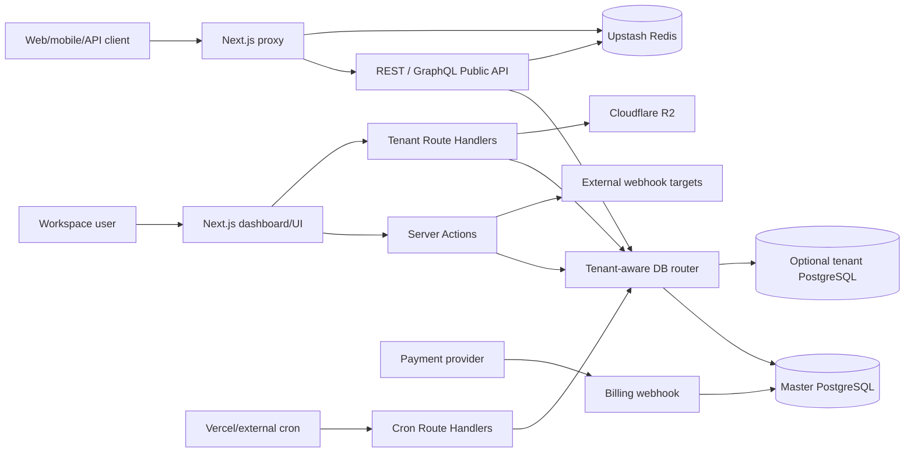
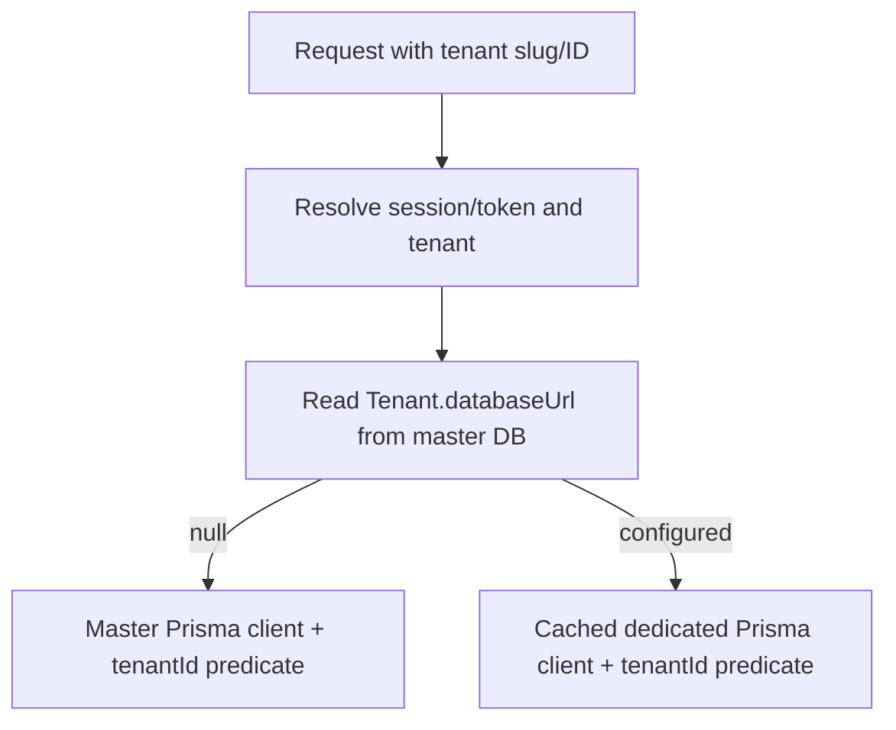

# Technical Design & System Architecture

**Baseline:** 19 June 2026  
**Status:** Living technical design synchronized by static inspection  
**Runtime:** Next.js 16 / React 19 / TypeScript / Prisma 6 / PostgreSQL

## 1. Architectural style

SaCMS is a modular monolith packaged as one Next.js application. Dashboard UI, Server Actions, API Route Handlers, public content delivery, authentication, billing, and scheduled jobs share one repository and deployment unit. Individual Route Handlers may execute as isolated serverless functions on supported platforms.

The design combines:

- App Router pages and layouts for UI composition.
- React Server Components by default, Client Components for interactive editors.
- Server Actions for authenticated dashboard mutations.
- Route Handlers for public APIs, tenant APIs, provider callbacks, and cron.
- PostgreSQL as the canonical persistent store.
- Prisma as the ORM and generated type source.
- Redis for distributed cache, rate limiting, and verified custom-domain mapping.
- Cloudflare R2 for media object storage.
- External providers for payment, email, AI, OAuth, and monitoring.

## 2. Runtime topology

## 3. Technology stack

| Layer | Technology | Responsibility |
|---|---|---|
| Framework | Next.js 16 App Router | UI, routing, Server Actions, Route Handlers, proxy |
| UI | React 19, Tailwind CSS 4, Radix/shadcn | Dashboard, editor, accessible primitives |
| Data | PostgreSQL, Prisma 6 | Relational metadata and JSONB content |
| Cache/limits | Upstash Redis | Response cache, distributed counters, domain map |
| Media | Cloudflare R2, AWS S3 SDK, Sharp | Object storage and image variants |
| Authentication | NextAuth v4, bcrypt | Credentials/OAuth and JWT sessions |
| Public API | REST, GraphQL | External content delivery/integration |
| Payments | Provider abstraction; Midtrans primary | Checkout, transaction, subscription, invoice |
| AI | DeepSeek via OpenAI-compatible SDK | Optional authoring assistance |
| Monitoring | Sentry plus database metrics | Error capture and operational views |
| Verification tooling | Vitest, Playwright | Separate verification phase; not run in this audit |

Exact package versions are defined in `package.json` and take precedence over narrative versions.

## 4. Multi-tenant data architecture

### 4.1 Shared database mode

When `Tenant.databaseUrl` is null, `getTenantDb()` returns the master Prisma client. Tenant-owned records MUST include `tenantId` in access predicates.

### 4.2 Dedicated database mode

When `Tenant.databaseUrl` exists, `getTenantDb()` creates/caches a Prisma client for that URL. Clients are keyed by URL and disconnected after an idle timeout. Master metadata such as the tenant and membership remains resolved through the master client.

### 4.3 Isolation invariant

Dedicated routing is an additional boundary, not a replacement for tenant predicates. Code must remain safe when the same query executes against the shared database fallback.

## 5. Core repository modules

| Module | Responsibility |
|---|---|
| `database.ts` | Master client and cached dedicated tenant clients |
| `tenant-access.ts` | Membership/super-admin access resolution |
| `rbac.ts` | Standard and custom permission evaluation |
| `content-workflow-rules.ts` | Pure state-machine and role rules |
| `content-workflow.ts` | Reviewer persistence/sequence operations |
| `content-validations.ts` | Runtime schema validation |
| `validations/dynamic-validator.ts` | Required/type/unique checks from `SchemaField` |
| `filters.ts` | Allowlisted filter parsing and parameterized SQL fragments |
| `content-resolver.ts` | Relation/component resolution |
| `graphql-schema.ts` | Dynamic GraphQL type and resolver generation |
| `webhooks.ts` | Sync hooks, async delivery, signatures, DLQ/replay |
| `tenant-plan.ts` | Plan configuration and feature flags |
| `plan-enforcement.ts` | Resource usage and limit enforcement |
| `cache.ts` | Redis-backed cache abstraction |
| `rate-limit.ts` | Redis limiter with process-memory fallback |
| `r2.ts` | R2 client and media object operations |

## 6. External service matrix

| Service | Protocol | Purpose | Implementation note |
|---|---|---|---|
| Cloudflare R2 | S3-compatible API | Media storage | Object keys are tenant-scoped; image variants are generated on upload when supported |
| Upstash Redis | HTTPS REST | Cache, rate limiting, domain mapping | Used at the edge and in server-side guards |
| Midtrans Snap | HTTPS API | Billing and subscriptions | Webhooks update transaction and subscription state |
| DeepSeek | HTTPS API via OpenAI-compatible SDK | AI content assistance | Routes are feature-gated and never bypass validation |

## 7. Runtime design notes

- Server Actions resolve session, tenant access, RBAC, plan gates, validation, hooks, and audit logging in that order.
- Public APIs authenticate before cache lookup and always enforce tenant scoping.
- Workspace limits and account workspace caps are enforced before creation or mutation, not after the quota is exceeded.
- Custom domain routing is activated only after DNS verification and cached mapping update.
- Verification tooling is separate from runtime and is not used to assert production readiness by default.
