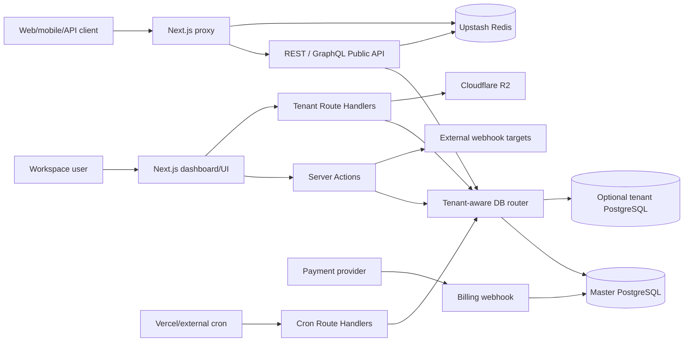
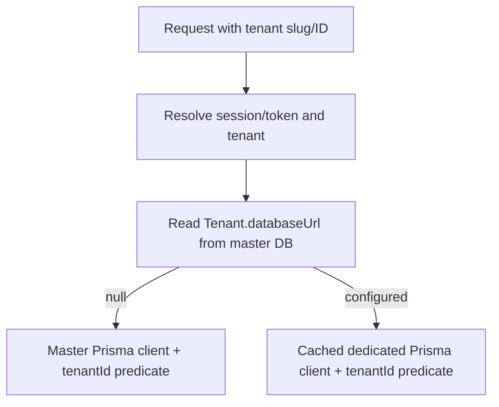
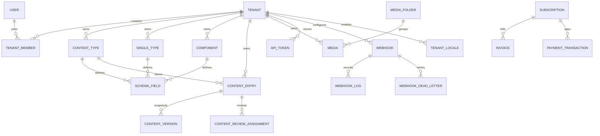
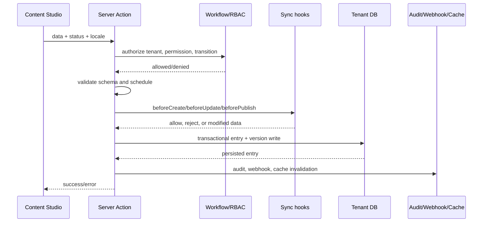

<<<<<<< HEAD
# Technical Design & System Architecture
=======
# System Architecture Document (SAD)
>>>>>>> 9b50af6e8ed16d25ac05384876bc74c76e7d32c0

**Baseline:** 19 June 2026  
**Status:** Living technical design synchronized by static inspection  
**Runtime:** Next.js 16 / React 19 / TypeScript / Prisma 6 / PostgreSQL

## 1. Architectural style

SaCMS is a modular monolith packaged as one Next.js application. Dashboard UI, Server Actions, API Route Handlers, public content delivery, authentication, billing, and scheduled jobs share one repository and deployment unit. Individual Route Handlers may execute as isolated serverless functions on supported platforms.

The design combines:

- App Router pages and layouts for UI composition.
- React Server Components by default, Client Components for interactive editors.
- Server Actions for authenticated dashboard mutations.
- Route Handlers for public APIs, tenant APIs, provider callbacks, and cron.
- PostgreSQL as the canonical persistent store.
- Prisma as the ORM and generated type source.
- Redis for distributed cache, rate limiting, and verified custom-domain mapping.
- Cloudflare R2 for media object storage.
- External providers for payment, email, AI, OAuth, and monitoring.

## 2. Runtime topology



<<<<<<< HEAD
## 3. Technology stack
=======
## 4. Pattern Desain Utama
### 4.1. Multi-Tenant Data Isolation
Setiap tabel krusial memiliki field `tenantId`. Akses database dibungkus menggunakan pola abstraksi repositori untuk menghindari kebocoran data.
**Implementasi Wajib:**
```typescript
// Cara Salah (Dilarang):
const data = await prisma.contentEntry.findMany()

// Cara Benar (Menggunakan helper getTenantDb):
const tenantDb = await getTenantDb(tenantId)
const data = await tenantDb.contentEntry.findMany()
```
>>>>>>> 9b50af6e8ed16d25ac05384876bc74c76e7d32c0

| Layer | Technology | Responsibility |
|---|---|---|
| Framework | Next.js 16 App Router | UI, routing, Server Actions, Route Handlers, proxy |
| UI | React 19, Tailwind CSS 4, Radix/shadcn | Dashboard, editor, accessible primitives |
| Data | PostgreSQL, Prisma 6 | Relational metadata and JSONB content |
| Cache/limits | Upstash Redis | Response cache, distributed counters, domain map |
| Media | Cloudflare R2, AWS S3 SDK, Sharp | Object storage and image variants |
| Authentication | NextAuth v4, bcrypt | Credentials/OAuth and JWT sessions |
| Public API | REST, GraphQL | External content delivery/integration |
| Payments | Provider abstraction; Midtrans primary | Checkout, transaction, subscription, invoice |
| AI | DeepSeek via OpenAI-compatible SDK | Optional authoring assistance |
| Monitoring | Sentry plus database metrics | Error capture and operational views |
| Verification tooling | Vitest, Playwright | Separate verification phase; not run in this audit |

Exact package versions are defined in `package.json` and take precedence over narrative versions.

<<<<<<< HEAD
## 4. Repository modules
=======
## 5. Skema Database Inti (Prisma ERD Concept)
- **Tenant & User:** Relasi Many-to-Many via `TenantMember`.
- **Content Modeling:** `ContentType` (Tabel) memiliki banyak `ContentTypeField` (Kolom).
- **Content Data:** Data tersimpan dinamis dalam kolom tipe `JSONB` di tabel `ContentEntry`.
- **Media:** `Media` terhubung ke `MediaFolder` dan `Tenant`, menggunakan penyimpanan R2 CDN.
- **Webhooks & API Tokens:** Tabel `Webhook`, `WebhookLog`, `ApiToken` dengan relasi kuat ke `Tenant`.

**Cuplikan Contoh Prisma Schema:**
```prisma
model Tenant {
  id        String   @id @default(uuid())
  name      String
  slug      String   @unique
  entries   ContentEntry[]
  media     Media[]
}

model ContentEntry {
  id            String   @id @default(uuid())
  documentId    String   @default(uuid()) // Unique identifier for all locales/versions
  tenantId      String
  contentTypeId String
  data          Json     // Data dinamis tersimpan di sini
  status        String   @default("DRAFT")
  
  tenant        Tenant   @relation(fields: [tenantId], references: [id])
  @@index([tenantId, contentTypeId])
}
```

## 6. Codebase Structure & Modules
Aplikasi terbagi dalam direktori-direktori inti:
- **`src/app/api/public/`**: Endpoint REST API untuk konsumsi frontend eksternal (Read-only, terproteksi API Token).
- **`src/app/api/tenant/`**: Internal API untuk modul administrasi Tenant (Media upload, Stripe webhook, System logs).
- **`src/app/admin/` & `src/app/dashboard/`**: UI panel administrasi dibangun dengan Next.js Server Components.
- **`src/actions/`**: Modul Server Actions untuk *mutations* data (Create, Update, Delete) yang di-*trigger* dari UI, mendukung progresif enhancement dan revalidasi cache.
- **`src/lib/`**: Utilitas *core* seperti mesin `filters.ts`, `database.ts` (Prisma Singleton), `rate-limit.ts` (Upstash Redis), dan `r2.ts`.

## 7. Quality Assurance (Testing & CI/CD)
Arsitektur dirancang agar siap diuji (*testable*):
- **Unit Tests:** Memastikan logika filter, role transitions, dan utility functions berjalan benar via `Vitest`.
- **E2E Tests:** Menggunakan `Playwright`. Sesi *mock login* diinisialisasi melalui `global-setup.ts` dengan tenant *Enterprise* untuk mencegah interupsi limit plan selama pengujian asinkron. Pipeline pengujian ini siap diintegrasikan dengan GitHub Actions.
# Technical Design Document (TDD)
**Project Name:** SaCMS (SaaS Headless CMS)
**Date:** 17 Juni 2026
**Status:** Approved

Dokumen ini menjelaskan desain teknis untuk SaCMS, mencakup struktur modul, arsitektur basis data, desain API, serta layanan dan integrasi eksternal pendukung.

---

## 1. Struktur Modul & Arsitektur (*Module Structure*)

Sistem dibangun secara *Monolithic-Serverless* menggunakan **Next.js 16 (App Router)**. *Codebase* dibagi secara modular untuk memisahkan domain antara Antarmuka Pengguna (*UI*) dan Layanan API.
>>>>>>> 9b50af6e8ed16d25ac05384876bc74c76e7d32c0

```text
src/
├── actions/                         # Authenticated dashboard mutations
├── app/
│   ├── (content)/cms/[tenant]/      # Content Studio
│   ├── (system)/admin/              # Platform administration
│   ├── (workspace)/dashboard/       # Workspace and account dashboard
│   ├── api/admin/                   # Platform admin Route Handlers
│   ├── api/auth/                    # NextAuth and verification helpers
│   ├── api/billing/                 # Checkout/provider notifications
│   ├── api/cron/                    # Scheduled publish, retry, backup
│   ├── api/public/                  # REST/GraphQL content delivery
│   └── api/tenant/[tenant]/         # Session-authenticated workspace API
├── components/
│   ├── cms/                         # CMS-specific interactive components
│   ├── content/                     # Field renderers and workflow display
│   ├── dashboard/                   # Navigation and workspace shell
│   └── ui/                          # Shared UI primitives
├── hooks/                           # Browser hooks
├── lib/                             # Business rules and infrastructure adapters
└── proxy.ts                         # Security headers, limits, version/domain rewrites
```

Additional roots:

- `prisma/schema.prisma`: canonical database schema.
- `prisma/migrations/`: versioned database migrations.
- `mini-services/sdk/`: TypeScript SDK package.
- `scripts/`: setup, seed, migration, and operational utilities.
- `docs/`: requirements, contracts, workflows, and runbooks.

## 5. Layer responsibilities

### 5.1 UI layer

Pages and client components are responsible for navigation, form state, progressive feedback, and exposing only operations likely to succeed for the current role. UI visibility is convenience, not authorization.

### 5.2 Server Action layer

Server Actions:

1. Resolve the NextAuth session.
2. Resolve tenant access.
3. Check RBAC and workflow permission.
4. Validate data.
5. Execute sync hooks.
6. Write through tenant-aware Prisma.
7. Create versions/audit records.
8. Trigger async events and invalidate caches.
9. Revalidate relevant paths.

### 5.3 Route Handler layer

- `/api/public`: Bearer-token integration surface.
- `/api/tenant`: session-authenticated dashboard/integration operations.
- `/api/admin`: platform administrator operations.
- `/api/billing`: provider-facing payment lifecycle.
- `/api/cron`: secret-authenticated scheduled jobs.

### 5.4 Business-rule layer

Important modules:

| Module | Responsibility |
|---|---|
| `database.ts` | Master client and cached dedicated tenant clients |
| `tenant-access.ts` | Membership/super-admin access resolution |
| `rbac.ts` | Standard and custom permission evaluation |
| `content-workflow-rules.ts` | Pure state-machine and role rules |
| `content-workflow.ts` | Reviewer persistence/sequence operations |
| `content-validations.ts` | Runtime schema validation |
| `validations/dynamic-validator.ts` | Required/type/unique checks from `SchemaField` |
| `filters.ts` | Allowlisted filter parsing and parameterized SQL fragments |
| `content-resolver.ts` | Relation/component resolution |
| `graphql-schema.ts` | Dynamic GraphQL type and resolver generation |
| `webhooks.ts` | Sync hooks, async delivery, signatures, DLQ/replay |
| `tenant-plan.ts` | Plan configuration and feature flags |
| `plan-enforcement.ts` | Resource usage and limit enforcement |
| `cache.ts` | Redis-backed cache abstraction |
| `rate-limit.ts` | Redis limiter with process-memory fallback |
| `r2.ts` | R2 client and media object operations |

<<<<<<< HEAD
## 6. Multi-tenant data architecture
=======
| Penyedia (*Service*) | Protokol | Tujuan | Detail Implementasi |
|----------------------|----------|--------|---------------------|
| **Cloudflare R2** | S3-Compatible API | Penempatan Aset (CDN) | Pola Penamaan Objek: `uploads/{tenantId}/{year}/{month}/{uuid}-{filename}.{ext}`. CDN terhubung secara publik. |
| **Upstash Redis** | HTTPS REST | Manajemen Cache & Limiter | Rate limiting dieksekusi di Edge. Format struktur Redis Key: `rate-limit:api:{tenantId}:{clientIp}`. |
| **Midtrans Snap** | HTTPS API | Otomasi *Billing* & *Invoice* | Terhubung untuk menagih biaya paket berlangganan pada *Tenant*. Endpoint Webhook Next.js merespons notifikasi `transaction_status`. |
| **OpenAI / LLM** | HTTPS API | *AI Content Generation* | Menyediakan saran konten (*templating*) otomatis di *Rich Text Editor*. |

# Data Flow Diagram (DFD) - SaCMS
>>>>>>> 9b50af6e8ed16d25ac05384876bc74c76e7d32c0

### 6.1 Shared database mode

When `Tenant.databaseUrl` is null, `getTenantDb()` returns the master Prisma client. Tenant-owned records MUST include `tenantId` in access predicates.

### 6.2 Dedicated database mode

When `Tenant.databaseUrl` exists, `getTenantDb()` creates/caches a Prisma client for that URL. Clients are keyed by URL and disconnected after an idle timeout. Master metadata such as the tenant and membership remains resolved through the master client.

### 6.3 Isolation invariant

Dedicated routing is an additional boundary, not a replacement for tenant predicates. Code must remain safe when the same query executes against the shared database fallback.



## 7. Core data model

### 7.1 Identity and tenancy

- `User`, `Account`, `Session`, `VerificationToken`
- `Tenant`, `TenantMember`, `TenantRole`
- `Permission`, `RolePermission`
- `CustomPlanOverride`

### 7.2 Schema and content

- `ContentType`, `SingleType`, `Component`
- Canonical `SchemaField`
- Legacy/specialized `SingleTypeField` and `ComponentField` remain present for compatibility
- Tenant assignment tables for global schemas
- `ContentEntry`, `ContentVersion`, `ContentReviewAssignment`

Collection data is stored in `ContentEntry.data` as JSONB. System metadata such as status, locale, publication dates, tenant, actor IDs, and document grouping remains in typed columns.

### 7.3 Integration and operations

- `ApiToken` for hashed public credentials
- `ApiKey` for legacy/system-key compatibility
- `Webhook`, `WebhookLog`, `WebhookDeadLetter`
- `AuditLog`, `ApiRequest`, `SystemMetric`, `Setting`

### 7.4 Billing

- `Subscription`, `Invoice`, `PaymentTransaction`

### 7.5 Media and localization

- `MediaFolder`, `Media`
- `TenantLocale`
- Localized Single Type data in `TenantSingleTypeAssignment`

## 8. High-level ERD



## 9. Content write flow



The normative state machine is in document 14.

## 10. Public REST read flow

1. Proxy applies IP-level rate limiting and security headers.
2. Route requires Bearer syntax.
3. Token is hashed with SHA-256 and resolved from `ApiToken`.
4. Tenant and expiry are validated.
5. Token-hash rate limiting runs.
6. Content Type availability and requested status are authorized.
7. Cache is checked using tenant, content type, token ID, and complete URL.
8. Filters/search/sort are compiled using allowlisted fields/operators.
9. Entries and requested relations are tenant-scoped.
10. Response includes data, content type metadata, pagination, rate-limit headers, and cache state.

## 11. Filter and search design

Dynamic JSONB filters use a two-step design:

- `parseFilters()` accepts at most 20 conditions and validates field/operator names.
- `buildFilterSQL()` creates SQL fragments with positional parameters for values.

Full-text search sanitizes control characters, truncates the query, and uses PostgreSQL `tsvector` plus `ILIKE` fallback. Dynamic sort names are limited to fields from the schema or known system columns.

## 12. GraphQL design

The GraphQL schema is built from the tenant-visible schemas at request time. A DataLoader-backed context and content resolver expand relations/components. Query operations require a valid token; mutations additionally require `full-access`.

Mutation resolvers are responsible for tenant ownership, hooks, audit, and async events. Workflow transitions must remain consistent with the pure workflow rules when a mutation changes status.

## 13. Webhook design

### 13.1 Synchronous hooks

- Executed before create, update, delete, or publish.
- Five-second timeout.
- May return `{ reject: true, message }` or replacement `{ data }`.
- Circuit breaker skips a hook after three consecutive failures.

### 13.2 Asynchronous webhooks

- Executed after the primary write using background `waitUntil` where available.
- Ten-second timeout.
- Optional custom headers and HMAC-SHA256 signature.
- Results persisted in `WebhookLog`.
- Failures persisted in `WebhookDeadLetter` for cron retry.

## 14. Cache and rate limiting

### 14.1 Cache

Public collection responses use a five-minute internal Redis TTL. HTTP responses are marked private to prevent a shared CDN from serving an authenticated payload across clients. Content mutations invalidate the collection namespace.

### 14.2 Rate limits

`src/proxy.ts` applies surface-level limits; Public API routes also limit authenticated tokens. Redis is the distributed source when available. The memory fallback is per process and therefore cannot guarantee a global limit in serverless/multi-instance deployments.

## 15. Custom-domain design

Domain ownership is stored in PostgreSQL, verified through DNS TXT, then materialized into Redis as `domain:{hostname} -> tenantSlug`. Request-time proxy rewriting depends on that Redis mapping. See document 13 for exact paths and failure handling.

## 16. Background jobs

| Route | Method | Current Vercel cadence | Responsibility |
|---|---|---|---|
| `/api/cron/publish` | GET | Every 5 minutes | Publish due scheduled entries |
| `/api/cron/webhook-retry` | GET | Every 2 minutes | Process Webhook DLQ |
| `/api/admin/billing/generate-invoices` | GET/POST | Daily at 00:00 | Generate billing invoices |
| `/api/cron/backup` | GET | Not present in current Vercel cron list | Trigger configured backup flow |

All cron routes must enforce the expected secret/auth model. Operational scheduling must match `vercel.json` or the self-hosted scheduler, not an outdated example.

## 17. Security design summary

- bcrypt credentials and JWT sessions.
- SHA-256 API token lookup.
- Tenant ownership in data queries.
- RBAC plus custom permissions.
- State-machine enforcement for content status.
- Zod/explicit validation at route boundaries.
- Parameterized dynamic filter values.
- HMAC webhook signatures.
- Cron secret authorization.
- Global security headers and explicit Public API CORS behavior in proxy.

See document 09 for policy detail and document 15 for implementation constraints.

## 18. Design constraints and known debt

- The package version (`0.2.0`) and product release labels are not currently the same versioning stream.
- Both canonical `SchemaField` and legacy specialized field models remain in Prisma.
- The stable public OpenAPI file covers only a subset of runtime routes.
- No direct REST route for `/content/{type}/{entryId}` currently exists.
- AI usage is returned but not persisted as an authoritative quota ledger.
- Custom domains depend on Redis at request time and support one hostname per tenant.
- Verification status requires an authorized test/build/integration phase; this synchronization was static only.
