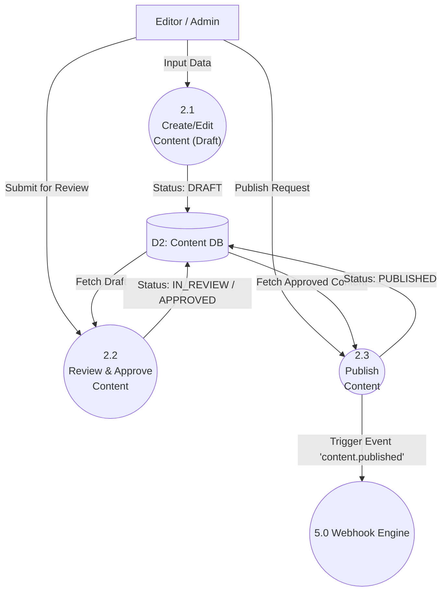
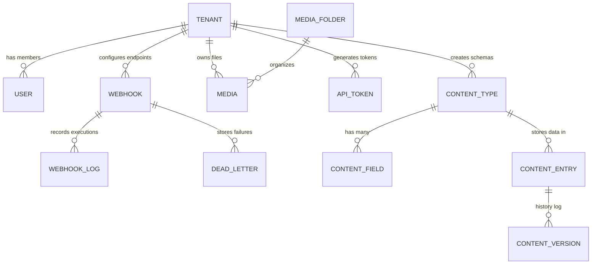

# System Architecture Document (SAD)

## 1. Overview
SaCMS adalah SaaS Headless CMS multi-tenant yang dibangun menggunakan arsitektur modern berbasis Edge dan Serverless. Dokumen ini menjelaskan rancangan teknis, tumpukan teknologi (tech stack), dan pola komunikasi antar komponen.

## 2. Technology Stack
- **Framework Utama:** Next.js 16 (App Router, Server Components, Server Actions)
- **Database:** PostgreSQL (Enterprise-ready)
- **ORM:** Prisma ORM
- **Cache & Rate Limiting:** Upstash Redis (Edge compatible)
- **Media Storage:** Cloudflare R2 (S3-compatible API)
- **Authentication:** NextAuth v4 (OAuth & Credentials) + Custom API Tokens (`cf_...`)
- **Pembayaran:** Midtrans Snap API
- **Styling UI:** TailwindCSS v4 + Radix UI (shadcn/ui)

## 3. Fitur Unggulan Next.js yang Diterapkan
Aplikasi secara ekstensif memanfaatkan kapabilitas Next.js 16 (App Router):
- **Server Components & Server Actions:** *Fetch* dan *mutate* data langsung di *server* (tanpa API *layer* tambahan untuk *internal dashboard*) untuk menghindari *waterfall requests* dan mempercepat interaksi.
- **Route Handlers & Middleware:** Membangun *Public* REST/GraphQL API dengan pengamanan otentikasi, *rate-limiting* terintegrasi Edge (Upstash Redis), dan *custom domain routing* di tingkat *Middleware*.
- **Dynamic HTML Streaming:** *Render* UI secara asinkron menggunakan React Suspense, memberikan pengalaman *dashboard* yang instan tanpa *blocking*.
- **Advanced Routing & Route Groups:** Memanfaatkan *route groups* Next.js secara ekstensif (`(public)`, `(content)`, `(system)`, `(workspace)`, `(billing)`) untuk isolasi logika antar domain fitur.
- **Data Fetching & Client/Server Rendering (ISR):** Kombinasi fleksibel antara *Server Fetching*, *Client Fetching*, dan dukungan *caching* (ISR) untuk menyajikan API super cepat.
- **Built-in Optimizations & CSS:** Pemanfaatan optimasi gambar/font bawaan serta *styling* menggunakan integrasi murni Tailwind CSS v4 + UI komponen berbasis Radix.

## 4. High-Level Architecture
Sistem ini menggunakan arsitektur Monolithic-Serverless. Front-end (Admin Dashboard) dan Back-end (API Routes) berada dalam satu *codebase* Next.js, yang mana API routes dapat di-deploy sebagai Serverless Functions.

```text
[ Client / SPA / Mobile App ] <--- REST / GraphQL API ---> [ Next.js API Routes ]
                                                                  |
[ Tenant Admin / Dashboard ] <---- React Server Components ----> [ Next.js Core ]
                                                                  |
                                      +---------------------------+---------------------------+
                                      |                           |                           |
                                [ PostgreSQL ]               [ Redis ]                 [ Cloudflare R2 ]
                                (Main Database)           (Cache & Rate Limit)         (CDN Media Storage)
```

## 4. Pattern Desain Utama
### 4.1. Multi-Tenant Data Isolation
Setiap tabel krusial memiliki field `tenantId`. Akses database dibungkus menggunakan pola abstraksi repositori untuk menghindari kebocoran data.
**Implementasi Wajib:**
```typescript
// Cara Salah (Dilarang):
const data = await prisma.contentEntry.findMany()

// Cara Benar (Menggunakan helper getTenantDb):
const tenantDb = await getTenantDb(tenantId)
const data = await tenantDb.contentEntry.findMany()
```

### 4.2. Advanced Filter Engine
Mengadopsi gaya Strapi (JSON-based filters). API menerima object filter seperti `filters[price][$gt]=100`, lalu modul `lib/filters.ts` akan mem-parsing dan menerjemahkannya menjadi Query Prisma yang aman (Parameterized SQL Injection safe).

### 4.3. Webhooks & Event-Driven
Menggunakan pola sinkron dan asinkron:
- **Sync Hooks:** Dieksekusi *sebelum* data masuk ke DB (contoh: `beforeCreate`). Dapat membatalkan mutasi.
- **Async Webhooks:** Dieksekusi *setelah* data berubah (contoh: `created`). Menggunakan *Dead Letter Queue* (DLQ) dan Cron Retries jika *endpoint* webhook tujuan mati.

## 5. Skema Database Inti (Prisma ERD Concept)
- **Tenant & User:** Relasi Many-to-Many via `TenantMember`.
- **Content Modeling:** `ContentType` (Tabel) memiliki banyak `ContentTypeField` (Kolom).
- **Content Data:** Data tersimpan dinamis dalam kolom tipe `JSONB` di tabel `ContentEntry`.
- **Media:** `Media` terhubung ke `MediaFolder` dan `Tenant`, menggunakan penyimpanan R2 CDN.
- **Webhooks & API Tokens:** Tabel `Webhook`, `WebhookLog`, `ApiToken` dengan relasi kuat ke `Tenant`.

**Cuplikan Contoh Prisma Schema:**
```prisma
model Tenant {
  id        String   @id @default(uuid())
  name      String
  slug      String   @unique
  entries   ContentEntry[]
  media     Media[]
}

model ContentEntry {
  id            String   @id @default(uuid())
  documentId    String   @default(uuid()) // Unique identifier for all locales/versions
  tenantId      String
  contentTypeId String
  data          Json     // Data dinamis tersimpan di sini
  status        String   @default("DRAFT")
  
  tenant        Tenant   @relation(fields: [tenantId], references: [id])
  @@index([tenantId, contentTypeId])
}
```

## 6. Codebase Structure & Modules
Aplikasi terbagi dalam direktori-direktori inti:
- **`src/app/api/public/`**: Endpoint REST API untuk konsumsi frontend eksternal (Read-only, terproteksi API Token).
- **`src/app/api/tenant/`**: Internal API untuk modul administrasi Tenant (Media upload, Stripe webhook, System logs).
- **`src/app/admin/` & `src/app/dashboard/`**: UI panel administrasi dibangun dengan Next.js Server Components.
- **`src/actions/`**: Modul Server Actions untuk *mutations* data (Create, Update, Delete) yang di-*trigger* dari UI, mendukung progresif enhancement dan revalidasi cache.
- **`src/lib/`**: Utilitas *core* seperti mesin `filters.ts`, `database.ts` (Prisma Singleton), `rate-limit.ts` (Upstash Redis), dan `r2.ts`.

## 7. Quality Assurance (Testing & CI/CD)
Arsitektur dirancang agar siap diuji (*testable*):
- **Unit Tests:** Memastikan logika filter, role transitions, dan utility functions berjalan benar via `Vitest`.
- **E2E Tests:** Menggunakan `Playwright`. Sesi *mock login* diinisialisasi melalui `global-setup.ts` dengan tenant *Enterprise* untuk mencegah interupsi limit plan selama pengujian asinkron. Pipeline pengujian ini siap diintegrasikan dengan GitHub Actions.
# Technical Design Document (TDD)
**Project Name:** SaCMS (SaaS Headless CMS)
**Date:** 17 Juni 2026
**Status:** Approved

Dokumen ini menjelaskan desain teknis untuk SaCMS, mencakup struktur modul, arsitektur basis data, desain API, serta layanan dan integrasi eksternal pendukung.

---

## 1. Struktur Modul & Arsitektur (*Module Structure*)

Sistem dibangun secara *Monolithic-Serverless* menggunakan **Next.js 16 (App Router)**. *Codebase* dibagi secara modular untuk memisahkan domain antara Antarmuka Pengguna (*UI*) dan Layanan API.

```text
src/
├── app/
│   ├── (public)/                 # Landing page & halaman publik
│   ├── (content)/                # Halaman manajemen konten
│   ├── (system)/                 # Halaman pengaturan sistem
│   ├── (workspace)/dashboard/    # Panel kontrol Admin (React Server Components)
│   ├── (billing)/                # Halaman penagihan dan paket
│   ├── api/
│   │   ├── public/[tenant]/      # Endpoint Konsumsi API (GraphQL & REST)
│   │   ├── tenant/[tenant]/      # Endpoint Internal Admin (Media, Webhook settings)
│   │   └── cron/                 # Background jobs (Scheduled publish, DLQ retries)
├── actions/                      # Next.js Server Actions untuk interaksi Data Mutations UI
├── components/                   # Shadcn UI & Atomic Components
├── lib/                          # Core Services Singleton
│   ├── database.ts               # Prisma Client Singleton
│   ├── filters.ts                # Parser Filter Strapi-style ke AST
│   ├── rate-limit.ts             # Upstash Redis limiter
│   └── r2.ts                     # Integrasi CDN & Object Storage
├── types/                        # Skema Zod & Typescript definitions
└── middleware.ts                 # Interceptor Request (Auth, Edge caching, Security Headers)
```

## 2. Desain Basis Data (*Database Design*)

SaCMS menggunakan **PostgreSQL** yang dikelola melalui **Prisma ORM**. Seluruh data direlasikan secara relasional dan dokumen semi-terstruktur (`JSONB`).

* **Multi-Tenant Routing:** Diatur pada level modul (via `getTenantDb(tenantId)`) guna membatasi dan mencegah kebocoran data (*data leakage*).
* **Entitas Utama:**
  * `Tenant`: Merepresentasikan *Workspace* atau agensi.
  * `User` & `TenantMember`: Pengaturan RBAC (*Role-Based Access Control*).
  * `ContentType` & `ContentTypeField`: Penyimpanan skema dinamis dari pengguna (*Schema Builder*).
  * `ContentEntry`: Tabel raksasa yang menyimpan konten aktual dalam kolom bertipe `JSONB` untuk memastikan skema fleksibel.
  * `Media`: Metadata penyimpanan *file* yang mengarah ke URL Cloudflare R2.
  * `Webhook` & `ApiToken`: Kredensial untuk akses dan *trigger* API eksternal.

*(Rincian lengkap dari skema ERD tersedia di dokumen [Database ERD](./database_erd.md))*

## 3. Desain API (*API Design*)

Sistem menyediakan dua antarmuka konsumsi utama bagi pengembang *frontend*:

### 3.1 RESTful API Publik
Sistem mengadopsi mekanisme *advanced filtering* ala Strapi CMS yang mengubah *query string* panjang menjadi *AST* lalu ditranslasi ke *SQL query*.
* **Format Request:**
  `GET /api/public/{tenant}/content/{type}?filters[title][$contains]=next&populate=author`
* **Operator Logika Terdukung:**
  `$eq`, `$ne`, `$gt`, `$gte`, `$lt`, `$lte`, `$contains`, `$in`, `$null`
* **Respon Balasan:** Berformat *JSON Array* standar dengan meta paginasi.

### 3.2 GraphQL API Dinamis
Fasilitas ini mengekspos tipe data secara dinamis mengikuti *Content Types* yang dibuat oleh *Tenant*.
* Endpoint: `POST /api/public/{tenant}/graphql`
* Mendukung fitur *Nested Selection* untuk mengambil data berelasi tanpa *waterfall query*.
* Endpoint *Mutation* (`createArticle`, `updateArticle`) diamankan dengan wajib menyertakan Token `full-access`.

### 3.3 Routing Subdomain & Autentikasi
Akses menuju antarmuka manajemen (UI) sepenuhnya menggunakan arsitektur *Subdomain Routing* yang diatur melalui `Next.js Middleware`.
* **Pola Rute (Route Rewrites):**
  - Akses menuju *root* subdomain (`[slug].sacms.com/`) akan di-_rewrite_ menuju rute internal `/cms/[slug]`, memunculkan antarmuka Pengelolaan Konten (CMS) secara langsung.
  - Akses menuju `/dashboard` pada subdomain (`[slug].sacms.com/dashboard`) akan di-_rewrite_ menuju rute internal `/dashboard/[slug]`, memunculkan panel pengaturan Workspace Admin.
* **Autentikasi Sesi Lintas Domain (Cross-Subdomain Session):**
  Sistem menerapkan batasan login (Login Boundaries) yang sangat ketat berdasarkan _Role_ (Peran) pengguna:
  - **Super Admin & Global Admin:** Wajib melakukan login melalui Website/Domain Utama (`sacms.com`). Jika mengakses login lewat subdomain, akses ditolak dan akan dialihkan.
  - **Workspace Admin & Owner:** Wajib melakukan login melalui Website/Domain Utama. Melalui domain utama, mereka memiliki akses utuh ke panel Manajemen Workspace (`/dashboard`).
  - **Pengelola Konten (Editor, Contributor, dsb.):** Secara eksklusif *hanya* dapat melakukan login dari halaman subdomain masing-masing workspace (contoh: `[slug].sacms.com/login`). Login mereka tidak diizinkan pada domain utama.
  
  Halaman autentikasi global maupun sistem (`/login`, `/register`, `/admin`) sengaja di-*exclude* dari proses *rewrite* Middleware untuk menghindari konflik _routing_ lintas domain.
*(Detail lengkap format *Request* dan *Response* tersedia pada spesifikasi [OpenAPI](./API_REFERENCE.md))*

## 4. Konfigurasi Layanan Inti (*Core Services*)

Layanan pendukung pada modul `src/lib/` yang menangani algoritma *backend* utama:
* **Filter Engine (`filters.ts`)**: Menerjemahkan *input string* dari URL (REST) atau argumen GraphQL menjadi bentuk kueri prisma yang aman dari injeksi SQL.
* **Content State Machine (`content-workflow.ts`)**: Menerapkan logika aturan transisi (contoh: *Role Member* hanya boleh mentransisi entri dari `DRAFT` menjadi `IN_REVIEW`).

## 5. Integrasi Sistem Eksternal

Arsitektur SaCMS dirancang ringan pada sisi pangkalan data utama, dengan mendelegasikan beberapa *workload* ke layanan eksternal (*PaaS / SaaS*):

| Penyedia (*Service*) | Protokol | Tujuan | Detail Implementasi |
|----------------------|----------|--------|---------------------|
| **Cloudflare R2** | S3-Compatible API | Penempatan Aset (CDN) | Pola Penamaan Objek: `uploads/{tenantId}/{year}/{month}/{uuid}-{filename}.{ext}`. CDN terhubung secara publik. |
| **Upstash Redis** | HTTPS REST | Manajemen Cache & Limiter | Rate limiting dieksekusi di Edge. Format struktur Redis Key: `rate-limit:api:{tenantId}:{clientIp}`. |
| **Midtrans Snap** | HTTPS API | Otomasi *Billing* & *Invoice* | Terhubung untuk menagih biaya paket berlangganan pada *Tenant*. Endpoint Webhook Next.js merespons notifikasi `transaction_status`. |
| **Deepseek / LLM** | HTTPS API | *AI Content & Schema Gen* | Menyediakan *AI Content Generation* (saran konten otomatis di *Rich Text Editor*) dan *AI Schema Generate* (pembuatan struktur *field* dinamis). |

# Data Flow Diagram (DFD) - SaCMS

Dokumen ini memetakan aliran data pada sistem SaCMS. Diagram dibuat menggunakan format standar *Mermaid.js* agar dapat langsung dirender secara visual.

## 1. DFD Level 0 (Context Diagram)
Diagram Konteks menggambarkan interaksi sistem SaCMS secara keseluruhan dengan entitas eksternal (aktor atau sistem pihak ketiga).

```mermaid
graph TD
    %% Entitas Eksternal
    Admin["Tenant Admin / Editor"]
    ClientApp["Client Application (Web/Mobile)"]
    Midtrans["Midtrans Payment Gateway"]
    Webhooks["External Webhook Listeners"]

    %% Sistem Utama
    SaCMS(("SaCMS System"))

    %% Aliran Data
    Admin -->|Login Credentials, Content Data, Media Files, Schema Config| SaCMS
    SaCMS -->|Auth Token, CMS Dashboard UI, Analytics Data| Admin

    ClientApp -->|API Requests, Search Queries, Filter Params| SaCMS
    SaCMS -->|JSON Content, Media URLs| ClientApp

    SaCMS -->|Payment Request (Gross Amount)| Midtrans
    Midtrans -->|Webhook Notification (Payment Status)| SaCMS

    SaCMS -->|Event Triggers (JSON Payload)| Webhooks
    Webhooks -->|HTTP 200 OK / Failed Response| SaCMS
```

## 2. DFD Level 1
Level 1 memecah sistem utama (SaCMS) menjadi proses-proses inti yang lebih terperinci.

```mermaid
graph TD
    %% Entitas Eksternal
    Admin["Tenant Admin"]
    ClientApp["Client App"]
    Midtrans["Midtrans"]
    
    %% Proses-Proses Utama (Circles)
    P1(("1.0\nAuth & Tenant\nManagement"))
    P2(("2.0\nContent & Schema\nManagement"))
    P3(("3.0\nMedia\nProcessing"))
    P4(("4.0\nBilling &\nSubscription"))
    P5(("5.0\nWebhook &\nAPI Engine"))

    %% Data Stores (Cylinders)
    D1[("D1: Users & Tenants DB")]
    D2[("D2: Content & Schema DB")]
    D3[("D3: Media Meta DB")]
    D4[("D4: Transactions DB")]
    R2[("Ext: Cloudflare R2")]

    %% Aliran Auth & Tenant
    Admin -->|Credentials| P1
    P1 -->|Read/Write| D1
    P1 -->|Token/Session| Admin

    %% Aliran Content
    Admin -->|UI Mutation (Server Actions)| P2
    P2 -->|Save/Update/Delete| D2
    P2 -->|UI Revalidation & Toast| Admin
    P2 -->|Content Status| Admin
    
    %% Aliran Media
    Admin -->|Upload Files| P3
    P3 -->|Save Metadata| D3
    P3 -->|Upload Binary| R2
    R2 -->|CDN URL| P3
    P3 -->|Media URL| Admin

    %% Aliran Billing
    Admin -->|Select Plan| P4
    P4 -->|Create Invoice| D4
    P4 -->|Snap Token Request| Midtrans
    Midtrans -->|Payment Status| P4
    P4 -->|Update Plan Status| D1

    %% Aliran API Client
    ClientApp -->|Bearer Token & Query Params| P5
    P5 -->|Read (Only Published)| D2
    P5 -->|Formatted JSON Response| ClientApp
```

## 3. DFD Level 2: Content Management (Berdasarkan Proses 2.0)
Mendalami bagaimana aliran data terjadi di dalam proses Content Management, termasuk *Content Workflow* (Draft -> Review -> Publish).



## Deskripsi Entitas & Data Store
- **Entitas:**
  - `Admin`: Mewakili user (Super Admin, Tenant Admin, Editor) yang mengelola SaCMS.
  - `ClientApp`: Front-end pelanggan yang melakukan Fetch via API (Public API/GraphQL).
  - `Midtrans`: Layanan pihak ketiga untuk pemrosesan pembayaran paket SaaS.
  - `Webhooks`: Layanan eksternal milik klien (contoh: Vercel Deploy Hook) yang menerima notifikasi.
- **Data Stores (PostgreSQL):**
  - `D1 (Users & Tenants)`: Tabel `User`, `Tenant`, `TenantMember`, `TenantLocale`, `ApiKey`.
  - `D2 (Content & Schema)`: Tabel `ContentType`, `ContentEntry`, `ContentVersion`, `Component`.
  - `D3 (Media)`: Tabel `Media`, `MediaFolder`.
  - `D4 (Transactions)`: Tabel `Subscription`, `Invoice`.
  - `Ext (Cloudflare R2)`: Object Storage berbasis S3 untuk file fisik biner.
# Entity Relationship Diagram (ERD) & Database Schema

Dokumen ini mendeskripsikan struktur relasional database SaCMS. SaCMS menggunakan **PostgreSQL** dengan Prisma ORM.

## 1. High-Level ERD (Mermaid)



## 2. Struktur Tabel Utama

### A. Tabel `Tenant` & `User`
- **User:** Menyimpan kredensial otentikasi.
- **Tenant:** Entitas Workspace (mempunyai `slug`, `name`, `plan`).
- **TenantMember:** Tabel Pivot antara User dan Tenant, yang menyimpan `role` (owner, admin, editor).

### B. Tabel Core Content Engine
- **ContentType:** Skema dari tabel dinamis (contoh: "Articles").
- **ContentTypeField:** Definisi kolom dinamis (contoh: tipe teks, angka, relasi).
- **ContentEntry:** Tempat penyimpanan data. Berisi kolom `data` bertipe `JSONB` yang merepresentasikan baris konten sejati. Field `documentId` digunakan sebagai unique identifier.
- **ContentVersion:** Snapshot `JSONB` untuk mencatat riwayat perubahan (Audit Trail/Versioning).

### C. Media Storage
- **MediaFolder:** Hierarki folder penyimpanan.
- **Media:** Metadata file yang diupload. Memiliki `url` yang mengarah ke Cloudflare R2 CDN, serta kolom `storageKey`, `mimeType`, dan `size`.

### D. Security & Integrations
- **ApiToken:** Tabel penyimpanan token terenkripsi (SHA-256) untuk akses REST API.
- **Webhook & WebhookLog:** Tabel konfigurasi target URL webhook dan histori eksekusinya.
- **DeadLetter:** Antrian pesan untuk webhook yang gagal, yang akan di-retry oleh Cron.

## 3. Indexing & Performa
- **JSONB GIN Index:** Diterapkan secara manual pada kolom `data` di `ContentEntry` untuk memungkinkan filter pencarian bersarang yang cepat.
- **TSVECTOR Index:** Diterapkan untuk fitur Full-Text Search tingkat lanjut.
- **Composite Unique Keys:** Hampir semua tabel menggunakan kombinasi `[tenantId, slug]` untuk memastikan isolasi multi-tenant yang absolut di tingkat database.
