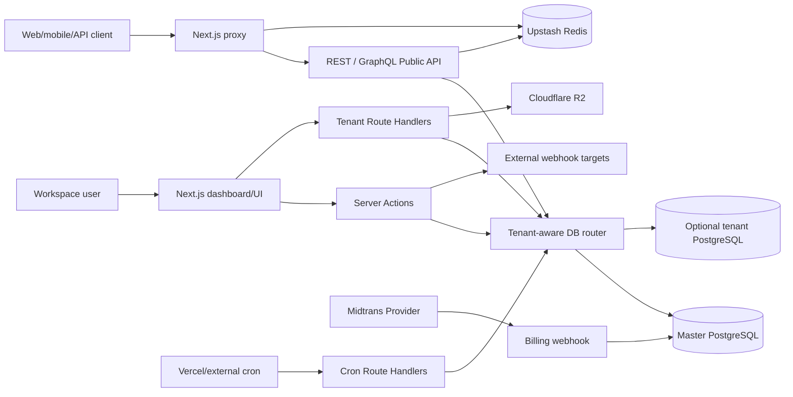
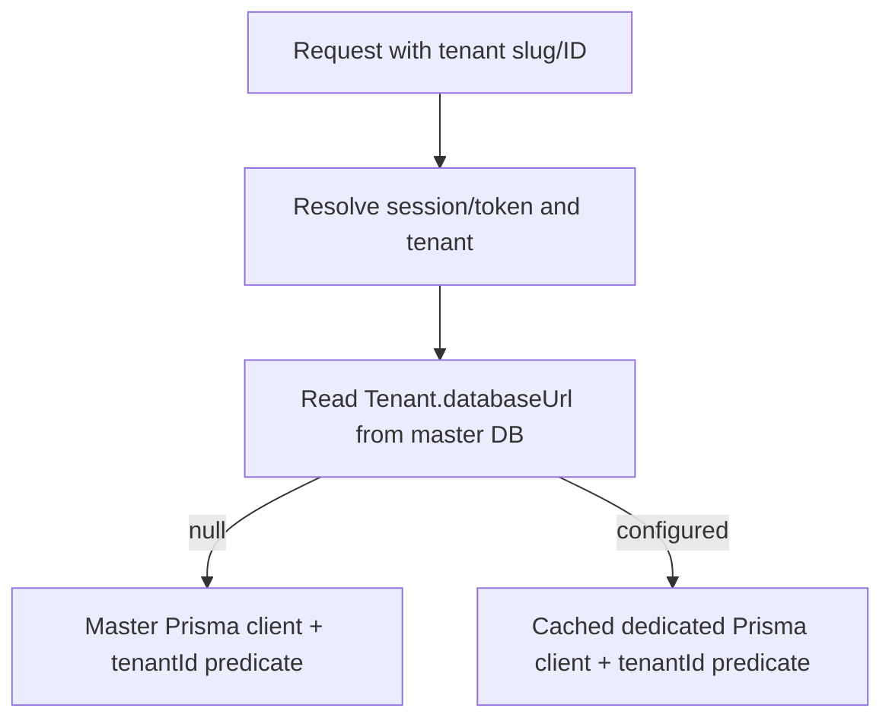

# Technical Design & System Architecture (TDD)
## Framework: Persona + Context + Task + Rules + Output Format

**Baseline:** 27 June 2026  
**Status:** Living technical design synchronized with codebase on 27 June 2026  
**Runtime:** Next.js 16 / React 19 / TypeScript / Prisma 6 / PostgreSQL

---

## 1. PERSONA

Anda adalah **Software Architect** dan **Database Engineer** untuk proyek SaCMS. Tanggung jawab Anda adalah merancang arsitektur sistem *modular monolith* yang tangguh, menentukan strategi *routing* basis data untuk *multi-tenancy*, serta memastikan integrasi layanan eksternal berjalan dengan aman, optimal, dan skalabel.

## 2. CONTEXT

### 2.1 Gaya Arsitektur (Architectural Style)
SaCMS dibangun sebagai *modular monolith* yang dikemas dalam satu aplikasi Next.js. Komponen seperti UI Dashboard, *Server Actions*, *API Route Handlers*, distribusi konten publik, autentikasi, pembayaran, dan *cron jobs* berbagi satu *repository* dan unit *deployment*. *Route Handlers* secara individual dapat dieksekusi sebagai *serverless functions* pada platform yang mendukung.

### 2.2 Teknologi Utama
Desain ini menggabungkan:
- **Next.js 16 (App Router):** Menggunakan *pages* dan *layouts* untuk komposisi UI. *React Server Components* digunakan secara *default*, dan *Client Components* untuk editor interaktif.
- **PostgreSQL & Prisma 6:** PostgreSQL sebagai penyimpanan persisten utama. Prisma bertindak sebagai ORM dan sumber *type-safety*.
- **Upstash Redis:** Digunakan untuk *distributed cache*, *rate limiting*, dan pemetaan domain kustom yang terverifikasi.
- **Cloudflare R2:** Sebagai *object storage* (kompatibel dengan S3) untuk menyimpan media.
- **Layanan Eksternal:** Integrasi penyedia pihak ketiga untuk pembayaran (Midtrans), AI (DeepSeek), OAuth (Google/GitHub), dan *monitoring* (Sentry).

## 3. TASK

Tugas Anda adalah merancang komponen sistem berikut:
1. **Runtime Topology:** Memetakan alur pengguna dari UI/API melalui *proxy* hingga ke basis data dan *webhook*.
2. **Multi-tenant Data Architecture:** Merancang strategi isolasi basis data baik secara konseptual (*tenantId*) maupun fisik (*Dedicated DB*).
3. **Core Modules Definition:** Mengategorikan modul-modul sistem berdasarkan fungsionalitas dan tanggung jawab masing-masing.

## 4. RULES

Sebagai *Software Architect*, Anda harus mematuhi aturan arsitektur berikut:
1. **Isolation Invariant:** Meskipun mode `Dedicated DB` aktif, kode aplikasi HARUS tetap aman dan secara eksplisit menyertakan `tenantId` (seolah-olah beroperasi pada `Shared DB`). *Dedicated routing* hanyalah batas keamanan tambahan, bukan pengganti predikat *tenant*.
2. **Auth-Before-Cache:** Semua panggilan API Publik harus diautentikasi (jika diperlukan) sebelum melakukan pencarian *cache*, dan selalu memberlakukan pembatasan ruang lingkup (*scoping*) *tenant*.
3. **Pre-mutation Enforcement:** Batas fitur (*Workspace limits*) dan kuota akun harus diperiksa *sebelum* pembuatan atau mutasi data (Bukan setelahnya).
4. **No Plugin UI / Framework:** Dilarang menggunakan ekstensi pihak ketiga (Plugin Marketplace) karena Next.js *App Router* membutuhkan kompilasi statis.
5. **No Stripe/Xendit:** Fokus *payment gateway* eksklusif menggunakan **Midtrans**.

## 5. OUTPUT FORMAT

### 5.1 Runtime Topology

```mermaid
flowchart LR
    User["Workspace user"] --> UI["Next.js dashboard/UI"]
    UI --> SA["Server Actions"]
    UI --> TenantAPI["Tenant Route Handlers"]

    Client["Web/mobile/API client"] --> Proxy["Next.js proxy"]
    Proxy --> PublicAPI["REST / GraphQL Public API"]

    Scheduler["Vercel/external cron"] --> Cron["Cron Route Handlers"]
    Payment["Midtrans Provider"] --> BillingWebhook["Billing webhook"]

    SA --> DBRouter["Tenant-aware DB router"]
    TenantAPI --> DBRouter
    PublicAPI --> DBRouter
    Cron --> DBRouter
    BillingWebhook --> MasterDB[("Master PostgreSQL")]

    DBRouter --> MasterDB
    DBRouter --> DedicatedDB[("Optional tenant PostgreSQL")]
    PublicAPI --> Redis[("Upstash Redis")]
    Proxy --> Redis
    TenantAPI --> R2["Cloudflare R2"]
    SA --> Webhook["External webhook targets"]
```

### 5.2 Multi-tenant Data Architecture

#### 5.2.1 Shared Database Mode
Ketika `Tenant.databaseUrl` adalah `null`, fungsi `getTenantDb()` akan mengembalikan Prisma Client *master*. Seluruh data yang dimiliki oleh *tenant* WAJIB menyertakan `tenantId` dalam predikat akses (`where`).

#### 5.2.2 Dedicated Database Mode (Enterprise)
Ketika `Tenant.databaseUrl` dikonfigurasi, `getTenantDb()` membuat/mengambil Prisma Client khusus untuk URL tersebut dari dalam *cache*. Client di-cache berdasarkan URL dan diputus koneksinya jika *idle*. Metadata master seperti tenant, integrasi, dan akses *membership* tetap diselesaikan melalui *master client*.

```mermaid
flowchart TD
    Request["Request with tenant slug/ID"] --> Access["Resolve session/token and tenant"]
    Access --> Lookup["Read Tenant.databaseUrl from master DB"]
    Lookup -->|"null"| Shared["Master Prisma client + tenantId predicate"]
    Lookup -->|"configured"| Dedicated["Cached dedicated Prisma client + tenantId predicate"]
```

### 5.3 Core Repository Modules

| Module | Responsibility |
|---|---|
| `database.ts` | Master client and cached dedicated tenant clients |
| `tenant-access.ts` | Membership/super-admin access resolution |
| `rbac.ts` | Standard and custom permission evaluation |
| `content-workflow-rules.ts` | Pure state-machine and role rules |
| `content-workflow.ts` | Reviewer persistence/sequence operations |
| `content-validations.ts` | Runtime schema validation |
| `validations/dynamic-validator.ts` | Required/type/unique checks from `SchemaField` |
| `filters.ts` | Allowlisted filter parsing and parameterized SQL fragments |
| `content-resolver.ts` | Relation/component resolution |
| `graphql-schema.ts` | Dynamic GraphQL type and resolver generation |
| `webhooks.ts` | Sync hooks, async delivery, signatures, DLQ/replay |
| `tenant-plan.ts` | Plan configuration and feature flags |
| `plan-enforcement.ts` | Resource usage and limit enforcement |
| `cache.ts` | Redis-backed cache abstraction |
| `rate-limit.ts` | Redis limiter with process-memory fallback |
| `r2.ts` | R2 client and media object operations |

### 5.4 External Service Matrix

| Service | Protocol | Purpose | Implementation note |
|---|---|---|---|
| Cloudflare R2 | S3-compatible API | Media storage | Object keys are tenant-scoped; image variants are generated on upload when supported |
| Upstash Redis | HTTPS REST | Cache, rate limiting, domain mapping | Used at the edge and in server-side guards |
| Midtrans Snap | HTTPS API | Billing and subscriptions | Webhooks update transaction and subscription state |
| DeepSeek | HTTPS API via OpenAI-compatible SDK | AI content assistance | Routes are feature-gated and never bypass validation |

### 5.5 Runtime Design Notes
- *Server Actions* menyelesaikan *session*, otorisasi *tenant*, RBAC, limit paket, validasi, *hooks*, dan *audit logging* dengan urutan tersebut secara ketat.
- *Custom domain routing* hanya diaktifkan setelah verifikasi DNS berhasil dan pemetaan *cache* Redis diperbarui.
