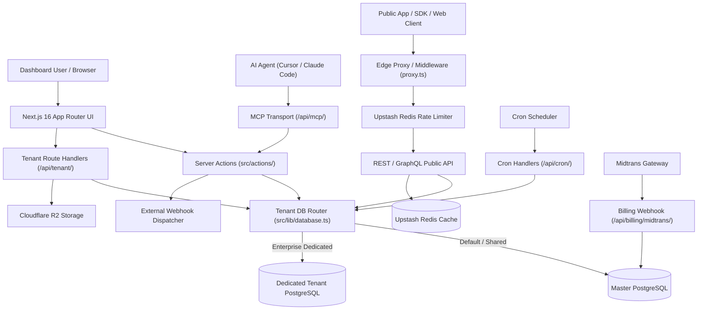
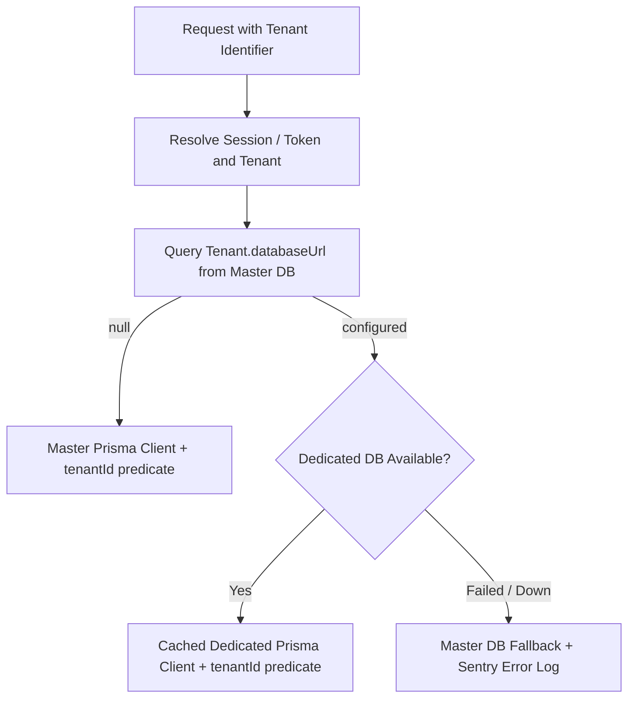

# Technical Design & System Architecture (TDD)
## Framework: Persona + Context + Task + Rules + Output Format

**Baseline:** 23 Agustus 2026  
**Status:** Living technical design synchronized with codebase on 23 August 2026 (v1.2.1.0)  
**Runtime:** Next.js 16 (App Router) / React 19 / TypeScript 5 / Prisma 6 / PostgreSQL 16 / TailwindCSS v4 / Upstash Redis / Cloudflare R2

---

## 1. PERSONA

Anda adalah **Software Architect** dan **Database Engineer** untuk proyek SaCMS. Tanggung jawab Anda adalah merancang arsitektur sistem *modular monolith* yang tangguh, menentukan strategi *routing* basis data untuk *multi-tenancy*, mengelola protokol AI/MCP, serta memastikan integrasi layanan eksternal berjalan dengan aman, optimal, dan skalabel.

## 2. CONTEXT

### 2.1 Gaya Arsitektur (Architectural Style)
SaCMS dibangun sebagai *modular monolith* yang dikemas dalam satu aplikasi Next.js 16 (App Router). Komponen seperti UI Dashboard, *Server Actions*, *API Route Handlers*, Model Context Protocol (MCP) server, distribusi konten publik REST/GraphQL, autentikasi NextAuth, pembayaran Midtrans, dan *cron jobs* berbagi satu *repository* dan unit *deployment*.

### 2.2 Teknologi Utama
- **Next.js 16 (App Router & Server Actions):** *React Server Components* digunakan secara default untuk kecepatan dan keamanan; *Client Components* digunakan secara granular pada editor formulir dinamis dan sandpack preview.
- **PostgreSQL & Prisma 6:** PostgreSQL sebagai penyimpanan data relasional dan JSONB. Prisma mengelola 45+ model dengan dukungan *dynamic routing* ke database tenant enterprise.
- **Upstash Redis:** Digunakan untuk *distributed cache*, *rate limiting* berbasis pipeline atomic, dan pemetaan domain kustom yang terverifikasi di level middleware proxy.
- **Cloudflare R2:** Sebagai *object storage* (kompatibel dengan S3 via `@aws-sdk/client-s3`) untuk menyimpan media dengan struktur key tenant-scoped (`${tenantId}/media/...`).
- **Model Context Protocol (MCP):** Endpoint native HTTP/SSE transport (`/api/mcp/[[...transport]]`) yang memungkinkan integrasi langsung dengan AI coding agents (Cursor, Windsurf, Claude Code).
- **Layanan Eksternal:** Integrasi penyedia pihak ketiga untuk pembayaran (Midtrans), AI Content & Schema (DeepSeek / OpenAI), Geolocation (GeoIP), dan *monitoring* (Sentry).

## 3. TASK

1. **Runtime Topology:** Memetakan alur pengguna dari UI/API/MCP melalui *proxy* hingga ke basis data dan *webhook*.
2. **Multi-tenant Data Architecture:** Merancang strategi isolasi basis data baik secara konseptual (`tenantId` predicate) maupun fisik (*Dedicated Enterprise Database* dengan failover guard).
3. **Core Modules Definition:** Mengategorikan modul-modul sistem berdasarkan fungsionalitas dan tanggung jawab masing-masing.

## 4. RULES

1. **Isolation Invariant:** Meskipun mode `Dedicated DB` aktif, kode aplikasi HARUS tetap aman dan secara eksplisit menyertakan `tenantId` (seolah-olah beroperasi pada `Shared DB`).
2. **Auth-Before-Cache:** Semua panggilan API Publik harus diautentikasi (jika diperlukan) sebelum melakukan pencarian *cache*, dan selalu memberlakukan pembatasan ruang lingkup (*scoping*) *tenant*.
3. **Pre-mutation Enforcement:** Batas fitur (*Workspace limits*) dan kuota akun harus diperiksa *sebelum* pembuatan atau mutasi data.
4. **Zod v4 Dynamic Validation:** Semua validasi payload di API routes dan Server Actions wajib menggunakan schema Zod yang telah dimutakhirkan.
5. **No Direct JSON.parse on Prisma Json:** Objek `Json` dari Prisma sudah otomatis di-deserialize; gunakan casting `data as Record<string, unknown>`.

## 5. OUTPUT FORMAT

### 5.1 Runtime Topology


```mermaid
flowchart TD
    User["Dashboard User / Browser"] --> UI["Next.js 16 App Router UI"]
    UI --> SA["Server Actions (src/actions/)"]
    UI --> TenantAPI["Tenant Route Handlers (/api/tenant/)"]

    AIAssistant["AI Agent (Cursor / Claude Code)"] --> MCPRoute["MCP Transport (/api/mcp/)"]
    MCPRoute --> SA

    Client["Public App / SDK / Web Client"] --> Proxy["Edge Proxy / Middleware (proxy.ts)"]
    Proxy --> RateLimit["Upstash Redis Rate Limiter"]
    RateLimit --> PublicAPI["REST / GraphQL Public API"]

    Scheduler["Cron Scheduler"] --> Cron["Cron Handlers (/api/cron/)"]
    Payment["Midtrans Gateway"] --> BillingWebhook["Billing Webhook (/api/billing/midtrans/)"]

    SA --> DBRouter["Tenant DB Router (src/lib/database.ts)"]
    TenantAPI --> DBRouter
    PublicAPI --> DBRouter
    Cron --> DBRouter
    BillingWebhook --> MasterDB[("Master PostgreSQL")]

    DBRouter -->|"Default / Shared"| MasterDB
    DBRouter -->|"Enterprise Dedicated"| DedicatedDB[("Dedicated Tenant PostgreSQL")]
    
    PublicAPI --> RedisCache[("Upstash Redis Cache")]
    TenantAPI --> R2["Cloudflare R2 Storage"]
    SA --> Webhooks["External Webhook Dispatcher"]
```

### 5.2 Multi-tenant Data Architecture

#### 5.2.1 Shared Database Mode
Ketika `Tenant.databaseUrl` adalah `null`, fungsi `getTenantDb(tenantId)` mengembalikan Prisma Client *master*. Seluruh query wajib menyertakan `tenantId` dalam predikat `where`.

#### 5.2.2 Dedicated Database Mode (Enterprise)
Ketika `Tenant.databaseUrl` dikonfigurasi, `getTenantDb(tenantId)` membuat/mengambil Prisma Client khusus untuk URL tersebut dari dalam *LRU cache* (dengan batas idle 10 menit). Jika koneksi database dedicated mengalami kegagalan, sistem secara otomatis menerapkan *safe failover* ke Master DB dengan logging error.


```mermaid
flowchart TD
    Request["Request with Tenant Identifier"] --> Access["Resolve Session / Token and Tenant"]
    Access --> Lookup["Query Tenant.databaseUrl from Master DB"]
    Lookup -->|"null"| Shared["Master Prisma Client + tenantId predicate"]
    Lookup -->|"configured"| DedicatedCheck{"Dedicated DB Available?"}
    DedicatedCheck -->|"Yes"| DedicatedClient["Cached Dedicated Prisma Client + tenantId predicate"]
    DedicatedCheck -->|"Failed / Down"| Fallback["Master DB Fallback + Sentry Error Log"]
```

### 5.3 Core Repository Modules

| Module Path | Tanggung Jawab Utama |
|---|---|
| `src/lib/database.ts` | Master Prisma client, enterprise dedicated client LRU pool, dan failover guard |
| `src/lib/tenant-access.ts` | Resolusi membership, role tenant, dan super-admin context |
| `src/lib/rbac.ts` | Evaluasi permission berbasis RBAC statis & dinamis (`RolePermission`) |
| `src/lib/content-workflow.ts` | State machine workflow konten (`DRAFT` → `IN_REVIEW` → `APPROVED` → `PUBLISHED`) |
| `src/lib/content-validations.ts` | Validasi runtime schema dynamic fields berbasis Zod v4 |
| `src/lib/ai/schema-engine.ts` | Intelligent domain schema design engine & blueprint generator |
| `src/lib/ai/domain-knowledge.ts` | Knowledge base blueprint untuk Hotel, E-Commerce, News, dan Agency |
| `src/lib/ai/agent-orchestrator.ts` | Multi-agent orchestrator untuk sintesis schema & website template |
| `src/lib/filters.ts` | Strapi-style query filters parser & parameterized SQL fragment builder |
| `src/lib/graphql-schema.ts` | Dynamic GraphQL type generator & deep recursive relation resolver |
| `src/lib/webhooks.ts` | Sync before-mutation hooks, async delivery, HMAC signatures, dan DLQ retry |
| `src/lib/rate-limit.ts` | Redis pipeline rate limiter (`cf:rl:*`) dengan in-memory fallback |
| `src/lib/cache.ts` | Redis Edge caching dengan pattern invalidation (`public_api:*`) |
| `src/lib/r2.ts` | Cloudflare R2 object upload, signed URL generator, dan thumbnail processor |
| `src/lib/license.ts` | RSA asymmetric public key validation & offline caching untuk Self-Hosted Enterprise |
| `src/lib/midtrans.ts` | Integrasi pembayaran langganan SaaS dan webhook processing |
| `src/lib/audit-log.ts` | Pencatatan audit trail untuk seluruh operasi mutasi data |

### 5.4 Route Groups & Directory Layout (Next.js 16)

```
src/app/
├── (public)/                                ← Public marketing & documentation pages
│   ├── page.tsx                             ← Modern landing page & feature showcases
│   ├── blog/page.tsx                        ← Blog & announcements
│   └── docs/page.tsx                        ← Interactive API & Developer Documentation
├── (system)/admin/                          ← Super Admin Control Panel
│   ├── layout.tsx                           ← Super admin authentication guard
│   ├── tenants/page.tsx                     ← Tenant lifecycle, quotas, overrides
│   ├── users/page.tsx                       ← Platform users & global role assignment
│   ├── billing/page.tsx                     ← Global revenue, invoices, transaction metrics
│   ├── monitoring/page.tsx                  ← System health, response times, active connections
│   └── enterprise/licenses/page.tsx         ← RSA Enterprise license generator & tracking
├── (workspace)/dashboard/[tenant]/          ← Tenant Workspace Dashboard
│   ├── (cms)/cms/                           ← Content Management System UI
│   │   ├── content/[slug]/page.tsx          ← Collection entry manager, bulk actions, FTS
│   │   ├── single-types/[slug]/page.tsx     ← Single type dynamic editor & locale tabs
│   │   └── components/page.tsx              ← Reusable schema components with impact analysis
│   ├── (dashboard)/                         ← Workspace management
│   │   ├── content-type-builder/            ← Visual drag-and-drop schema designer
│   │   ├── media/page.tsx                   ← Media library (Cloudflare R2)
│   │   ├── settings/page.tsx                ← Workspace settings, white-label, locales
│   │   └── subscriptions/page.tsx           ← Plan upgrades & Midtrans checkout
│   └── developer/                           ← Developer Hub & AI Protocol
│       ├── api/page.tsx                     ← Interactive REST API playground
│       ├── api-keys/page.tsx                ← SHA-256 API token generator
│       ├── graphql/page.tsx                 ← Embedded GraphiQL Explorer
│       ├── mcp/page.tsx                     ← Model Context Protocol token management
│       └── sdk/page.tsx                     ← TypeScript SDK guide & zip export
└── api/                                     ← REST, GraphQL, MCP, and Cron API Route Handlers
    ├── public/[tenant]/content/             ← Public REST endpoints
    ├── public/[tenant]/graphql/             ← Public GraphQL endpoint
    ├── public/[tenant]/single/              ← Public Single Types endpoint
    ├── mcp/[[...transport]]/                ← MCP Server transport endpoint
    ├── tenant/[tenant]/ai-builder/          ← AI Schema planner & starter zip exporter
    ├── cron/publish/                        ← Scheduled auto-publish cron
    └── webhooks/midtrans/                   ← Payment callback handler
```
