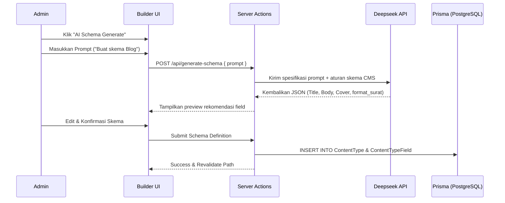
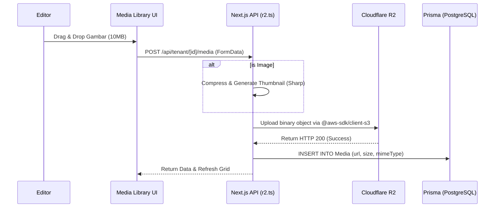
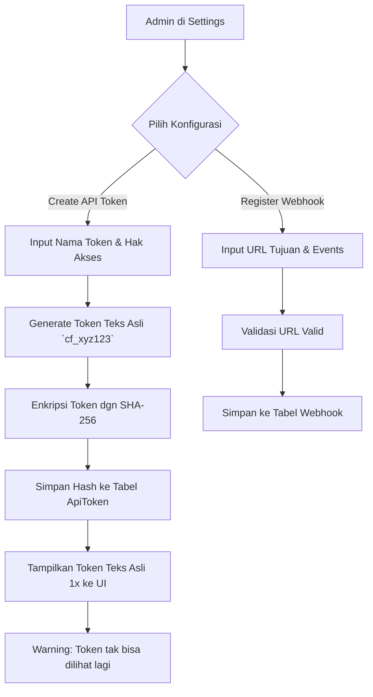

# Alur Flow Logika Halaman (Page Logic Flows)

Dokumen ini menjelaskan secara rinci alur logika (*logic flows*) dari setiap halaman utama di dalam sistem SaCMS, mulai dari proses *routing* di level Edge (Middleware), pengelolaan sesi, manajemen skema, hingga manajemen konten.

---

## 1. Authentication & Routing Flow (Middleware)
SaCMS menggunakan *custom domain routing* dan membagi batasan akses secara ketat antara Global Domain dan Tenant Subdomain. Proses ini dieksekusi di Edge sebelum *request* diteruskan ke *React Server Components*.

```mermaid
flowchart TD
    A[User Request] --> B{Is it API or Page?}
    
    %% API Rate Limiting
    B -- API (/api/public) --> C[Upstash Redis Rate Limiter]
    C -- Exceeded --> C1[Return 429 Too Many Requests]
    C -- Allowed --> C2[Execute API Handler]

    %% Page Routing
    B -- Page --> D{Check Domain}
    
    D -- sacms.com (Global) --> E{Path?}
    E -- /login --> F[Render Login Page]
    E -- /dashboard --> G{Has Session?}
    G -- No --> G1[Redirect to /login]
    G -- Yes --> G2{Is Super/Workspace Admin?}
    G2 -- Yes --> G3[Render Dashboard Workspace Selection]
    G2 -- No (Editor) --> G4[Redirect to Subdomain]

    D -- [tenant].sacms.com (Subdomain) --> H{Has Session?}
    H -- No --> H1[Render Tenant Login Page]
    H -- Yes --> H2{Check Tenant Access}
    H2 -- Denied --> H3[Return 403 Forbidden]
    H2 -- Allowed --> H4[Rewrite to /cms/[tenant]]
```

### Logika Utama:
1. **Rate Limiting:** Semua panggilan API Publik di-*intercept* dan divalidasi *rate limit*-nya berdasarkan *IP* atau *API Token* menggunakan Upstash Redis.
2. **Subdomain Rewrite:** Jika pengguna mengakses `tenant.sacms.com`, *Middleware* secara transparan menulis ulang (*rewrite*) URL menuju `/cms/[tenant]` di mana halaman CMS dirender.
3. **Session Check:** NextAuth di-*invoke* untuk memeriksa keberadaan *cookie* otentikasi.

---

## 2. Workspace & Billing Dashboard (`/dashboard`)
Halaman ini dikhususkan bagi Admin/Owner untuk mengatur *workspace* mereka dan membayar langganan.

```mermaid
flowchart TD
    A[Admin di /dashboard] --> B[Pilih/Buat Workspace]
    B --> C{Pilih Menu}
    
    C -- Upgrade Plan --> D[Pilih Plan (Pro/Enterprise)]
    D --> E[Hitung Proration API]
    E --> F[Panggil /api/checkout]
    F --> G[Midtrans Snap Token Generated]
    G --> H[Munculkan Modal Snap.js]
    H --> I[User Bayar]
    I --> J[Midtrans Async Webhook /api/midtrans/webhooks]
    J --> K[Update DB: Subscription & Invoice]

    C -- Manage Team --> L[Input Email & Role]
    L --> M[Server Action Invite Member]
    M --> N[Simpan ke TenantMember Pivot]
    N --> O[Kirim Email Undangan]
```

### Logika Utama:
1. **Proration API:** Saat pengguna *upgrade* di tengah bulan, sistem memanggil *endpoint* proration untuk menghitung sisa kredit yang dikonversi dari *plan* sebelumnya.
2. **Payment Gateway:** Snap.js bekerja di *client*, sementara pencatatan mutlak *Invoice* menunggu notifikasi *Webhook* asinkron dari Midtrans ke peladen.

---

## 3. Content Builder Page (`/cms/[tenant]/builder`)
Halaman perancangan struktur tabel basis data secara dinamis. Di sinilah **Deepseek AI Schema Generate** digunakan.



### Logika Utama:
1. **AI Generation:** Integrasi dengan Deepseek menerjemahkan bahasa natural menjadi objek skema JSON (berisi tipe seperti `text`, `media`, `format surat`).
2. **Modal Format Surat:** Jika terdapat tipe *field* "Format Surat", UI akan memunculkan *modal* tambahan agar Admin dapat memasukkan *Placeholder Key* yang mengikat *template* dokumen surat.

---

## 4. Content Manager Page (`/cms/[tenant]/content`)
Halaman ini merupakan rutinitas utama *Content Editor*. Meliputi pembuatan konten, penggunaan AI Text Editor, dan alur kerja (Workflow) publikasi.

```mermaid
flowchart TD
    A[Editor di Content Manager] --> B[Klik New Entry]
    B --> C[Render Form Berdasarkan Schema DB]
    
    C --> D{Gunakan AI Content?}
    D -- Yes --> E[Klik 'Generate with AI']
    E --> F[Kirim konteks judul ke Deepseek API]
    F --> G[Deepseek menyuntikkan teks ke Rich Text Editor]
    G --> H
    D -- No --> H[Ketik Teks Manual / Upload Media]

    H --> I{Tombol Aksi}
    
    I -- Save Draft --> J[Zod Validation (Hanya format)]
    J --> K[Prisma: Simpan JSONB dengan Status DRAFT]

    I -- Publish --> L[Zod Validation (Strict/Required)]
    L -- Gagal --> M[Tampilkan UI Error Zod]
    L -- Sukses --> N[Prisma: Simpan JSONB dengan Status PUBLISHED]
    N --> O[Picukan Event `content.entry.published`]
    O --> P[Jalankan Webhook Async]
```

### Logika Utama:
1. **Dynamic Form:** Form tidak di-*hardcode*, melainkan dirender di server berdasarkan data dari tabel `ContentTypeField`.
2. **AI Content Generate:** Komponen Editor memungkinkan Editor memanggil Deepseek untuk mengisi kolom secara otomatis berdasarkan *prompt*.
3. **Zod Validation & Workflow:** `Save as Draft` melompati aturan kolom `required`. Sebaliknya, proses `Publish` mengaktifkan validasi `Zod` tingkat ketat sebelum data tersimpan ke kolom `JSONB`.

---

## 5. Media Library Page (`/cms/[tenant]/media`)
Halaman untuk manajemen aset statis (gambar, video, PDF) yang diunggah dan disimpan langsung ke **Cloudflare R2**.



### Logika Utama:
1. **Edge CDN:** Data fisik gambar tidak pernah masuk basis data PostgreSQL. Basis data hanya mencatat URI. R2 bertindak sebagai penyimpanan persisten + CDN global.
2. **Image Processing:** Sistem menggunakan modul `sharp` (atau ekuivalen) di belakang layar untuk secara instan membuat varian resolusi.

---

## 6. Settings Page (Webhooks & API Tokens)
Halaman tempat Administrator menyambungkan CMS dengan sistem eksternal (*Frontend Client* / Aplikasi Mobile).



### Logika Utama:
1. **SHA-256 Hashing:** Token asli (`cf_xyz123`) hanya ditampilkan sekali pada layar. Sistem tidak menyimpan *plain-text*. Saat *Frontend* memanggil `/api/public`, Middleware akan meng-*hash* token bawaan (*Bearer*) lalu mencocokkannya ke basis data dalam kompleksitas waktu $O(1)$.
2. **Webhook Registration:** Mendefinisikan rute pihak ketiga mana saja yang perlu dikontak ketika sebuah `ContentEntry` dipublikasikan. Jika URL tujuan `timeout` saat pemanggilan, sistem memasukkannya ke antrian `Dead Letter Queue` (DLQ) untuk dicoba kembali oleh proses CRON (Retry).
