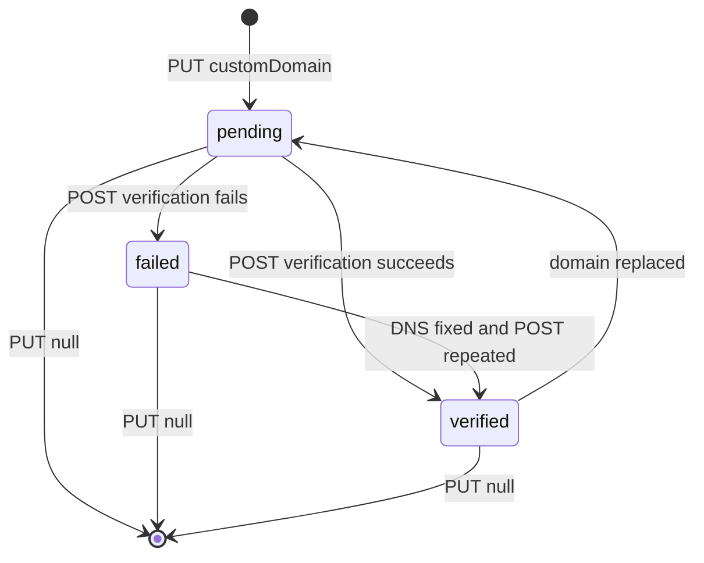
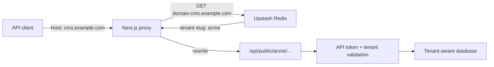

# White-Label & Custom Domain Guide

**Status:** Implemented with plan and infrastructure constraints  
**Primary code:** tenant white-label routes, custom-domain route, `src/proxy.ts`, and `Tenant` branding fields

## 1. Availability

White-label branding and custom domain are available to workspace plans:

- `pro`
- `enterprise`
- `custom`

The current data model supports exactly one `customDomain` per tenant. Multiple domains per Enterprise tenant are not implemented.

## 2. Roles

| Operation | Owner | Admin | Editor/member/viewer |
|---|:---:|:---:|:---:|
| Read branding configuration | Yes | Yes | Yes, when plan is eligible |
| Update branding | Yes | Yes | No |
| Read domain status | Yes | Yes | No |
| Register/clear domain | Yes | Yes | No |
| Trigger DNS verification | Yes | Yes | No |

Every route also verifies tenant membership and the eligible workspace plan.

## 3. Branding fields

| API field | Prisma field | Validation |
|---|---|---|
| `brandName` | `Tenant.brandName` | 1–100 characters |
| `brandLogo` | `Tenant.brandLogo` | URL or empty string |
| `primaryColor` | `Tenant.primaryColor` | Six-digit hex color |
| `customEmailSender` | `Tenant.customEmailSender` | Email or empty string |
| `faviconUrl` | `Tenant.faviconUrl` | URL or empty string |

Empty strings are normalized to `null` during update.

## 4. Branding API

### 4.1 Read

```http
GET /api/tenant/acme/white-label
Cookie: next-auth.session-token=...
```

Example response:

```json
{
  "brandName": "Acme Content Studio",
  "brandLogo": "https://cdn.example.com/acme-logo.svg",
  "primaryColor": "#1E40AF",
  "customEmailSender": "cms@example.com",
  "faviconUrl": "https://cdn.example.com/favicon.png",
  "customDomain": "cms.example.com",
  "customDomainStatus": "verified",
  "customDomainVerifiedAt": "2026-06-19T07:00:00.000Z"
}
```

### 4.2 Update

The implemented method is `PATCH`, not `PUT`.

```http
PATCH /api/tenant/acme/white-label
Content-Type: application/json

{
  "brandName": "Acme Content Studio",
  "brandLogo": "https://cdn.example.com/acme-logo.svg",
  "primaryColor": "#1E40AF",
  "faviconUrl": ""
}
```

The change creates a `SETTINGS_UPDATED` audit entry for entity `tenant_white_label`.

## 5. Domain lifecycle

Canonical statuses stored in `customDomainStatus`:

| Value | Meaning |
|---|---|
| `null` | No domain configured |
| `pending` | Domain saved; DNS proof not verified |
| `verified` | TXT proof found and routing mapping activated |
| `failed` | Last DNS verification attempt did not find the expected TXT record |



## 6. Register or clear a domain

The implemented method is `PUT`. The body field is `customDomain`.

```http
PUT /api/tenant/acme/white-label/domain
Content-Type: application/json

{
  "customDomain": "cms.example.com"
}
```

The server normalizes the hostname to lowercase. Clients must send a hostname without protocol, port, path, or trailing slash.

Response:

```json
{
  "customDomain": "cms.example.com",
  "customDomainStatus": "pending",
  "dnsVerification": {
    "type": "TXT",
    "name": "_sacms-verify.cms.example.com",
    "value": "sacms-verify=..."
  }
}
```

Clear the domain:

```json
{
  "customDomain": null
}
```

Clearing removes the tenant fields and deletes the Redis mapping for the previous hostname.

## 7. DNS setup and verification

Create both records with your DNS provider:

| Type | Name | Value/purpose |
|---|---|---|
| TXT | `_sacms-verify.cms.example.com` | Exact `dnsVerification.value` from the API |
| CNAME | `cms.example.com` | Canonical hostname of the SaCMS deployment |

Then trigger verification:

```http
POST /api/tenant/acme/white-label/domain
```

No request body is required. The server resolves TXT records with Node's DNS resolver and compares an exact value.

On success:

1. `customDomainStatus` becomes `verified`.
2. `customDomainVerifiedAt` receives the server time.
3. Redis key `domain:{hostname}` is set to the tenant slug.

On failure the API returns HTTP 400 with the expected TXT record and stores status `failed`.

## 8. Custom-host request paths

After verification, clients call the custom hostname without the normal `/api/public/{tenant}` prefix:

```text
https://cms.example.com/content/articles
https://cms.example.com/single/site-settings
https://cms.example.com/graphql
https://cms.example.com/brand
```

Optional version prefixes are accepted:

```text
https://cms.example.com/v1/content/articles
https://cms.example.com/v2/content/articles
```

The proxy rewrites internally:

```text
/content/articles
    -> /api/public/acme/content/articles
```

API token authentication is still required by the destination public route. A custom hostname does not bypass tenant or token checks.

## 9. Routing architecture



The request-time proxy reads Redis; it does not query PostgreSQL as a fallback. If Redis is unavailable or the mapping is missing, custom-host rewriting is unavailable even though the tenant record remains verified. Re-running domain verification repopulates the mapping.

## 10. CORS and security headers

The proxy applies security headers globally. Public API/custom-domain responses currently use permissive CORS:

```text
Access-Control-Allow-Origin: *
Access-Control-Allow-Methods: GET, POST, PUT, DELETE, OPTIONS
Access-Control-Allow-Headers: Authorization, Content-Type
```

This is suitable for token-authenticated public integrations but is not an origin allowlist. Never expose an API token in browser code that is delivered to untrusted users.

Other invariants:

- `Tenant.customDomain` is unique.
- Only a verified domain is added to Redis routing.
- Domain replacement returns to `pending`, clears the verified timestamp, and deletes the previous Redis mapping.
- Tenant status and Public API token rules continue to apply downstream.
- Domain verification tokens are deterministic from tenant ID and `NEXTAUTH_SECRET`; production must use a strong secret.

## 11. Dashboard workflow

1. Open `/dashboard/{tenant}/settings/white-label`.
2. Save branding fields.
3. Enter a hostname such as `cms.example.com`.
4. Copy the TXT record shown by the API/UI.
5. Configure TXT and CNAME at the DNS provider.
6. Wait for DNS propagation.
7. Trigger verification.
8. Call the custom hostname with a tenant API token.

## 12. Troubleshooting

| Symptom | Cause | Action |
|---|---|---|
| HTTP 403 from settings route | Plan is not eligible or user lacks role | Upgrade plan or use owner/admin |
| `Invalid domain format` | Protocol/path/port included | Send hostname only |
| HTTP 409 on registration | Domain belongs to another tenant | Use another domain or clear the old owner |
| Verification remains failed | TXT not propagated or value differs | Query DNS and copy exact value |
| Verified in DB but host does not route | Redis mapping unavailable | Restore Redis and repeat verification |
| Custom host returns token error | Missing/wrong tenant API token | Send valid Bearer token for that tenant |
| Browser request blocked | Header/method outside current CORS set | Use allowed headers or extend proxy policy deliberately |

## 13. Operational checklist

- `NEXT_PUBLIC_APP_URL` contains the canonical application host.
- `NEXTAUTH_SECRET` is strong and stable.
- Upstash Redis credentials are present.
- DNS CNAME points to the deployment's canonical host.
- TLS is provisioned by the hosting platform for the custom hostname.
- Re-verification is performed after Redis data loss.
- API tokens are never embedded in public source bundles.
