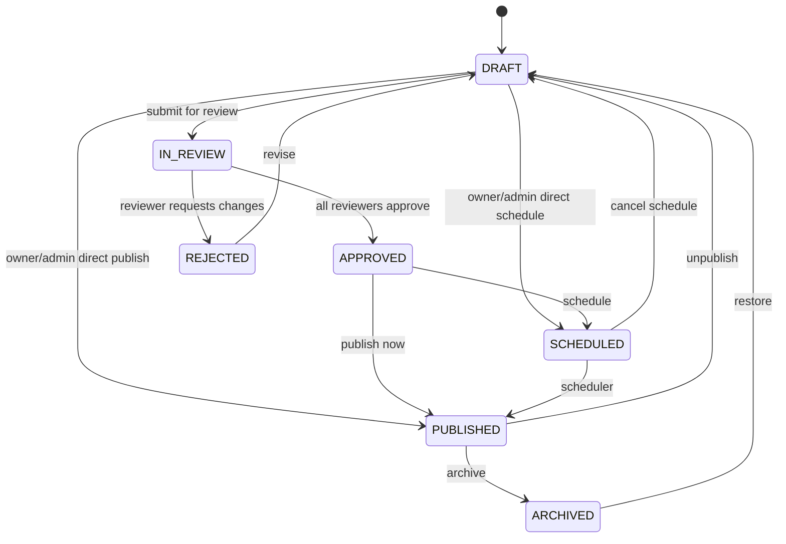

# Content Workflow & Approval Guide

**Document status:** Implemented baseline  
**Last synchronized:** 27 June 2026  
**Primary implementation:** `src/lib/content-workflow-rules.ts`, `src/actions/content.ts`, and `src/app/api/tenant/[tenant]/workflow/reviewers/route.ts`

## 1. Purpose

This document is the authoritative reference for the lifecycle of a collection entry in SaCMS. It defines the statuses, allowed transitions, role boundaries, sequential review process, scheduled publication, validation timing, and side effects that accompany each transition.

The workflow applies to `ContentEntry`. Single Types use a simpler save/publish model through `TenantSingleTypeAssignment` and are not part of the sequential reviewer workflow described here.

## 2. Workflow principles

1. Every new entry starts logically from `DRAFT`, even when an authorized owner/admin creates and immediately publishes or schedules it.
2. A status change is valid only when both the state transition and the actor's permission allow it.
3. Required fields may be incomplete while the entry remains `DRAFT`.
4. Before an entry leaves `DRAFT`, all required fields must pass dynamic schema validation.
5. Public read-only API tokens only see `PUBLISHED` content.
6. A scheduled entry requires a valid future `scheduledAt` value.
7. Reviewer assignments and decisions are always scoped to the same tenant as the entry.
8. Assigned reviewers act sequentially according to their `order` value. Owner/admin retain an explicit audited status override for exceptional cases.
9. Publishing invalidates the related Public API cache and emits publication side effects.

## 3. Status definitions

| Status | Meaning | Publicly visible | Typical owner |
|---|---|---:|---|
| `DRAFT` | Work in progress; required fields may still be empty | No | Author/editor |
| `IN_REVIEW` | Submitted and waiting for review | No | Current reviewer |
| `APPROVED` | All assigned reviewers approved, or an owner/admin approved directly | No | Owner/admin |
| `SCHEDULED` | Complete content waiting for automatic publication | No | Scheduler/cron |
| `PUBLISHED` | Live content available to Public API consumers | Yes | Owner/admin |
| `ARCHIVED` | Retired content retained in the CMS | No | Owner/admin |
| `REJECTED` | Review failed and changes are required | No | Author/editor |

## 4. State machine



Transitions not shown in this diagram are rejected by the server, even if a client manually submits them.

## 5. Role and transition matrix

| Transition | Owner | Admin | Editor | Member | Viewer | System |
|---|:---:|:---:|:---:|:---:|:---:|:---:|
| `DRAFT → IN_REVIEW` | Yes | Yes | Yes | Yes | No | No |
| `DRAFT → PUBLISHED` | Yes | Yes | No | No | No | No |
| `DRAFT → SCHEDULED` | Yes | Yes | No | No | No | No |
| `IN_REVIEW → APPROVED` | Yes | Yes | Through assigned review | Through assigned review | No | No |
| `IN_REVIEW → REJECTED` | Yes | Yes | Through assigned review | Through assigned review | No | No |
| `APPROVED → PUBLISHED` | Yes | Yes | No | No | No | No |
| `APPROVED → SCHEDULED` | Yes | Yes | No | No | No | No |
| `SCHEDULED → DRAFT` | Yes | Yes | No | No | No | No |
| `SCHEDULED → PUBLISHED` | No | No | No | No | No | Yes |
| `PUBLISHED → DRAFT` | Yes | Yes | No | No | No | No |
| `PUBLISHED → ARCHIVED` | Yes | Yes | No | No | No | No |
| `ARCHIVED → DRAFT` | Yes | Yes | Yes | No | No | No |
| `REJECTED → DRAFT` | Yes | Yes | Yes | Yes | No | No |

Custom roles may perform a transition when the role has the matching granular permission. The canonical permission keys are declared in `TRANSITION_PERMISSIONS` inside `src/lib/content-workflow-rules.ts`.

After adding/updating workflow permissions in an environment, run the authorized seed procedure based on `scripts/seed-workflow-permissions.ts`; changing the source list alone does not insert missing `Permission` rows into an existing database.

## 6. Entry creation workflow

### 6.1 Save as draft

1. The author opens `/cms/{tenant}/content/{contentType}/new`.
2. The UI resolves the user's tenant role and only displays statuses available from `DRAFT`.
3. The author enters partial or complete data.
4. The server validates field types and uniqueness while allowing required fields to remain empty.
5. Synchronous `content.beforeCreate` hooks may reject or modify the payload.
6. The entry and its first `ContentVersion` are created in one database transaction.
7. `documentId` is set to the first entry ID so locale variants can share one logical document.
8. `content.created` is emitted, audit data is recorded, and the relevant cache namespace is invalidated.

### 6.2 Create and submit for review

The same creation steps apply, but required-field validation is enforced because `IN_REVIEW` is not a draft state. Editors and members may use this path if their role or custom permission allows `workflow.draft_to_review`.

### 6.3 Create and publish directly

Only owner/admin may create directly as `PUBLISHED`. In addition to the normal creation hook, the `content.beforePublish` synchronous hook runs. After commit, both `content.created` and `content.published` asynchronous events are emitted.

### 6.4 Create and schedule directly

Only owner/admin may create directly as `SCHEDULED`. `scheduledAt` is mandatory, must parse as a valid date, and must be later than the current server time.

## 7. Editing and translation workflow

1. The server resolves the requested entry using `entryId`, `contentTypeId`, and `tenantId`; an ID from another tenant is treated as not found.
2. The logical `documentId` is used to resolve the requested locale.
3. If the locale variant does not yet exist, saving creates a new `ContentEntry` linked by the same `documentId`.
4. Localizable fields are stored per locale. Fields marked `localizable: false` are synchronized to the other locale variants.
5. A new locale variant follows the same initial-status authorization as a new entry. A role that cannot move `DRAFT` to `PUBLISHED` or `SCHEDULED` cannot bypass that rule through translation creation.
6. Validation is performed against the merged existing data and submitted data, not only the partial patch.
7. Saving an already published entry without changing its status does not reset the original `publishedAt` timestamp.
8. Every successful save creates a new `ContentVersion` snapshot.

## 8. Sequential review workflow

### 8.1 Assign reviewers

Reviewer assignment is available to workspace owner/admin while the entry is `DRAFT` or `IN_REVIEW`.

Server invariants:

- The entry must belong to the current tenant.
- Each reviewer must be a member of the same tenant.
- A `viewer` cannot be assigned as reviewer, and a custom-role reviewer must have `content.read`.
- The same user cannot appear twice.
- Reassigning the list replaces the previous chain and recalculates order from zero.

### 8.2 Submit for review

After reviewers are assigned, transition the entry from `DRAFT` to `IN_REVIEW`. If no reviewers are assigned, owner/admin may still perform a direct approval transition according to their workflow permission.

### 8.3 Reviewer decision

The first assignment with status `pending` is the current reviewer. A later reviewer cannot act before earlier reviewers finish.

- `approved`: marks the current assignment approved. If pending assignments remain, the entry stays `IN_REVIEW`. If none remain, the entry becomes `APPROVED`.
- `rejected`: marks the current assignment rejected and immediately changes the entry to `REJECTED`.

Owner/admin may directly transition `IN_REVIEW` to `APPROVED` or `REJECTED` as a workflow override. This bypasses the remaining reviewer chain and should be reserved for correction/administrative cases; the normal path is the sequential decision endpoint.

The decision endpoint is:

```http
PATCH /api/tenant/{tenant}/workflow/reviewers
Content-Type: application/json

{
  "entryId": "entry-id",
  "decision": "approved",
  "comment": "Ready to publish"
}
```

Review comments are limited to 2,000 characters by the endpoint. The final decision is written to the audit log.

## 9. Scheduled publication

`GET /api/cron/publish` processes due entries. It requires `Authorization: Bearer <CRON_SECRET>`.

For each tenant, the scheduler:

1. Selects `SCHEDULED` entries whose `scheduledAt <= now`.
2. Changes the status to `PUBLISHED`.
3. Sets `publishedAt` and clears `scheduledAt`.
4. Creates a `ContentVersion` with actor `system`.
5. Emits `content.published`.
6. Invalidates the collection's Public API cache.

The repository's current `vercel.json` invokes this job every five minutes. Therefore, publication is eventually consistent within approximately one scheduler interval, not guaranteed at the exact second selected by the user.

## 10. Validation by lifecycle stage

| Check | Draft | Review/Approved | Scheduled | Published |
|---|:---:|:---:|:---:|:---:|
| Known field type | Yes | Yes | Yes | Yes |
| Unique field | Yes | Yes | Yes | Yes |
| Required field | Deferred | Required | Required | Required |
| Valid future `scheduledAt` | N/A | N/A | Required | N/A |
| Transition permission | On change | Yes | Yes | Yes |
| Tenant ownership | Yes | Yes | Yes | Yes |
| Sync hooks | Before create/update | Before update | Before update | Before publish |

## 11. Side effects

| Operation | Version | Audit | Async webhook | Cache invalidation |
|---|:---:|:---:|---|:---:|
| Create draft | Yes | Yes | `content.created` | Yes |
| Update | Yes | Yes | `content.updated` | Yes |
| Publish | Yes | Yes | `content.published` | Yes |
| Unpublish | Yes | Yes | `content.unpublished` | Yes |
| Delete | Deleted with entry | Yes | `content.deleted` | Yes |
| Review decision | No content snapshot | Yes | `content.updated` when final | Not required until public state changes |
| Scheduled auto-publish | Yes | System operation | `content.published` | Yes |

## 12. Public API visibility

- A `read-only` token is always restricted to `PUBLISHED`, regardless of a supplied `status` query parameter.
- A `full-access` token may request another valid workflow status with `?status=...`.
- Related entries populated for a read-only token are also restricted to the same tenant and `PUBLISHED` status.
- Cache lookup occurs only after token, tenant, token expiry, and requested status have been authorized.

## 13. Common failure responses

| Message | Cause | Resolution |
|---|---|---|
| `Invalid content status` | Unknown status value | Use one of the seven canonical statuses |
| `You do not have permission...` | Role/custom permission blocks transition | Ask owner/admin or adjust role permission |
| `Validation failed` | Schema validation failed | Correct fields listed in `details` |
| `Scheduled publication date must be in the future` | Missing/past schedule | Select a future date/time |
| `It is not your turn to review` | Reviewer chain order not reached | Wait for earlier reviewer |
| `Entry not found` | Wrong ID, content type, or tenant | Re-resolve the entry in the current workspace |

## 14. Completion checklist for a content workflow change

Any future workflow change is incomplete until all of the following remain synchronized:

- `src/lib/content-workflow-rules.ts`
- Server-side mutation in `src/actions/content.ts`
- Reviewer API route
- Create/edit UI status choices
- RBAC seed permissions
- Cron behavior, when schedule semantics change
- This document
- SRS role and business-rule sections
- API specification and generated tenant OpenAPI output
