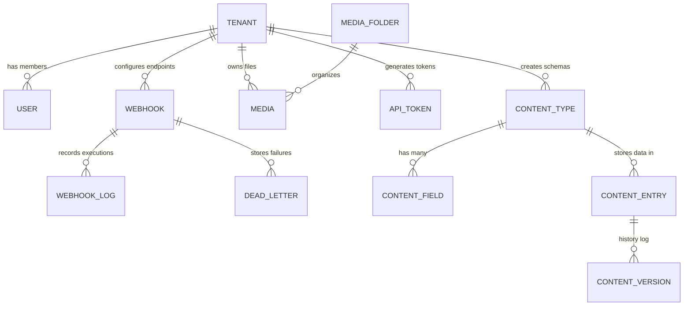

# Entity Relationship Diagram (ERD) & Database Schema

Dokumen ini mendeskripsikan struktur relasional database SaCMS. SaCMS menggunakan **PostgreSQL** dengan Prisma ORM.

## 1. High-Level ERD (Mermaid)

## 2. Struktur Tabel Utama

### A. Tabel `Tenant` & `User`
- **User:** Menyimpan kredensial otentikasi.
- **Tenant:** Entitas Workspace (mempunyai `slug`, `name`, `plan`).
- **TenantMember:** Tabel Pivot antara User dan Tenant, yang menyimpan `role` (owner, admin, editor).

### B. Tabel Core Content Engine
- **ContentType:** Skema dari tabel dinamis (contoh: "Articles").
- **ContentTypeField:** Definisi kolom dinamis (contoh: tipe teks, angka, relasi).
- **ContentEntry:** Tempat penyimpanan data. Berisi kolom `data` bertipe `JSONB` yang merepresentasikan baris konten sejati. Field `documentId` digunakan sebagai unique identifier.
- **ContentVersion:** Snapshot `JSONB` untuk mencatat riwayat perubahan (Audit Trail/Versioning).

### C. Media Storage
- **MediaFolder:** Hierarki folder penyimpanan.
- **Media:** Metadata file yang diupload. Memiliki `url` yang mengarah ke Cloudflare R2 CDN, serta kolom `storageKey`, `mimeType`, dan `size`.

### D. Security & Integrations
- **ApiToken:** Tabel penyimpanan token terenkripsi (SHA-256) untuk akses REST API.
- **Webhook & WebhookLog:** Tabel konfigurasi target URL webhook dan histori eksekusinya.
- **DeadLetter:** Antrian pesan untuk webhook yang gagal, yang akan di-retry oleh Cron.

## 3. Indexing & Performa
- **JSONB GIN Index:** Diterapkan secara manual pada kolom `data` di `ContentEntry` untuk memungkinkan filter pencarian bersarang yang cepat.
- **TSVECTOR Index:** Diterapkan untuk fitur Full-Text Search tingkat lanjut.
- **Composite Unique Keys:** Hampir semua tabel menggunakan kombinasi `[tenantId, slug]` untuk memastikan isolasi multi-tenant yang absolut di tingkat database.
