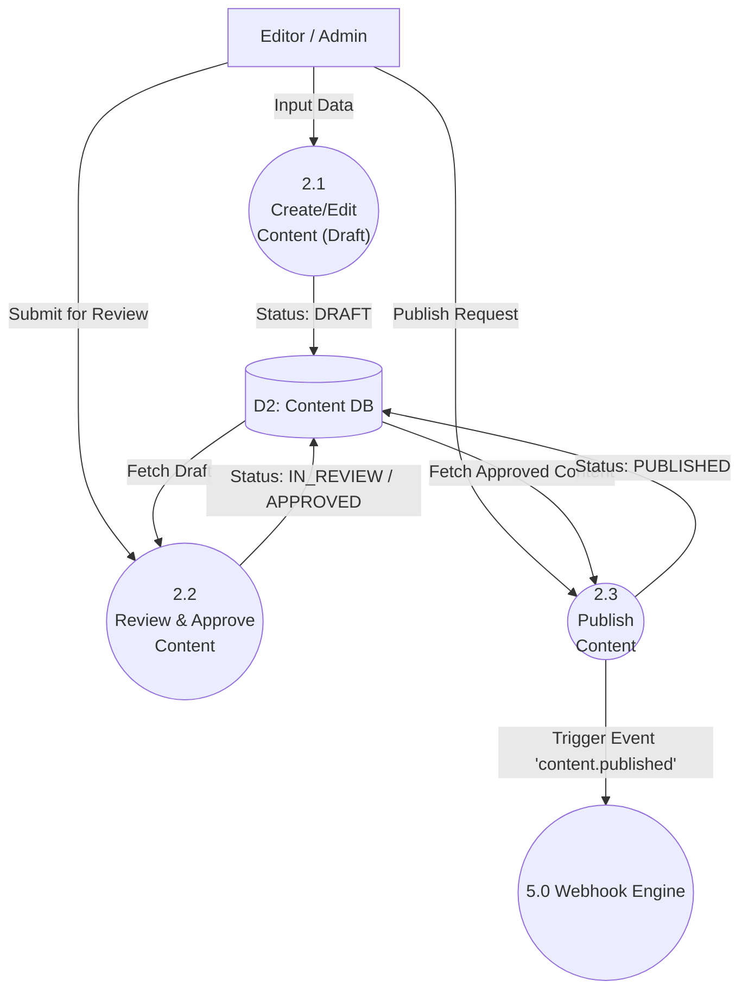

# Data Flow Diagram (DFD) - SaCMS

Dokumen ini memetakan aliran data pada sistem SaCMS. Diagram dibuat menggunakan format standar *Mermaid.js* agar dapat langsung dirender secara visual.

## 1. DFD Level 0 (Context Diagram)
Diagram Konteks menggambarkan interaksi sistem SaCMS secara keseluruhan dengan entitas eksternal (aktor atau sistem pihak ketiga).

```mermaid
graph TD
    %% Entitas Eksternal
    Admin["Tenant Admin / Editor"]
    ClientApp["Client Application (Web/Mobile)"]
    Midtrans["Midtrans Payment Gateway"]
    Webhooks["External Webhook Listeners"]

    %% Sistem Utama
    SaCMS(("SaCMS System"))

    %% Aliran Data
    Admin -->|Login Credentials, Content Data, Media Files, Schema Config| SaCMS
    SaCMS -->|Auth Token, CMS Dashboard UI, Analytics Data| Admin

    ClientApp -->|API Requests, Search Queries, Filter Params| SaCMS
    SaCMS -->|JSON Content, Media URLs| ClientApp

    SaCMS -->|Payment Request (Gross Amount)| Midtrans
    Midtrans -->|Webhook Notification (Payment Status)| SaCMS

    SaCMS -->|Event Triggers (JSON Payload)| Webhooks
    Webhooks -->|HTTP 200 OK / Failed Response| SaCMS
```

## 2. DFD Level 1
Level 1 memecah sistem utama (SaCMS) menjadi proses-proses inti yang lebih terperinci.

```mermaid
graph TD
    %% Entitas Eksternal
    Admin["Tenant Admin"]
    ClientApp["Client App"]
    Midtrans["Midtrans"]
    
    %% Proses-Proses Utama (Circles)
    P1(("1.0\nAuth & Tenant\nManagement"))
    P2(("2.0\nContent & Schema\nManagement"))
    P3(("3.0\nMedia\nProcessing"))
    P4(("4.0\nBilling &\nSubscription"))
    P5(("5.0\nWebhook &\nAPI Engine"))

    %% Data Stores (Cylinders)
    D1[("D1: Users & Tenants DB")]
    D2[("D2: Content & Schema DB")]
    D3[("D3: Media Meta DB")]
    D4[("D4: Transactions DB")]
    R2[("Ext: Cloudflare R2")]

    %% Aliran Auth & Tenant
    Admin -->|Credentials| P1
    P1 -->|Read/Write| D1
    P1 -->|Token/Session| Admin

    %% Aliran Content
    Admin -->|UI Mutation (Server Actions)| P2
    P2 -->|Save/Update/Delete| D2
    P2 -->|UI Revalidation & Toast| Admin
    P2 -->|Content Status| Admin
    
    %% Aliran Media
    Admin -->|Upload Files| P3
    P3 -->|Save Metadata| D3
    P3 -->|Upload Binary| R2
    R2 -->|CDN URL| P3
    P3 -->|Media URL| Admin

    %% Aliran Billing
    Admin -->|Select Plan| P4
    P4 -->|Create Invoice| D4
    P4 -->|Snap Token Request| Midtrans
    Midtrans -->|Payment Status| P4
    P4 -->|Update Plan Status| D1

    %% Aliran API Client
    ClientApp -->|Bearer Token & Query Params| P5
    P5 -->|Read (Only Published)| D2
    P5 -->|Formatted JSON Response| ClientApp
```

## 3. DFD Level 2: Content Management (Berdasarkan Proses 2.0)
Mendalami bagaimana aliran data terjadi di dalam proses Content Management, termasuk *Content Workflow* (Draft -> Review -> Publish).



## Deskripsi Entitas & Data Store
- **Entitas:**
  - `Admin`: Mewakili user (Super Admin, Tenant Admin, Editor) yang mengelola SaCMS.
  - `ClientApp`: Front-end pelanggan yang melakukan Fetch via API (Public API/GraphQL).
  - `Midtrans`: Layanan pihak ketiga untuk pemrosesan pembayaran paket SaaS.
  - `Webhooks`: Layanan eksternal milik klien (contoh: Vercel Deploy Hook) yang menerima notifikasi.
- **Data Stores (PostgreSQL):**
  - `D1 (Users & Tenants)`: Tabel `User`, `Tenant`, `TenantMember`, `TenantLocale`, `ApiKey`.
  - `D2 (Content & Schema)`: Tabel `ContentType`, `ContentEntry`, `ContentVersion`, `Component`.
  - `D3 (Media)`: Tabel `Media`, `MediaFolder`.
  - `D4 (Transactions)`: Tabel `Subscription`, `Invoice`.
  - `Ext (Cloudflare R2)`: Object Storage berbasis S3 untuk file fisik biner.
