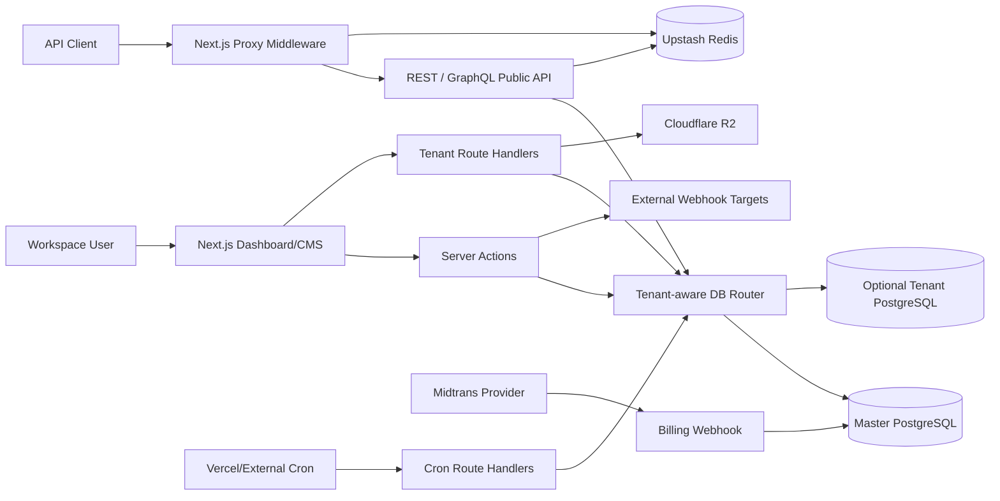
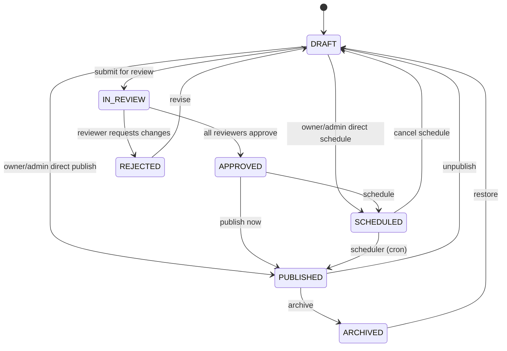

# SaCMS — System Requirements Specification (SRS)
## Framework: Persona + Context + Task + Rules + Output Format

> **Version:** 2.0  
> **Baseline:** 8 Juli 2026  
> **Disusun berdasarkan:** 15 dokumen SDLC resmi (`docs/01` – `docs/15`), enterprise docs, dan codebase aktif.

---

## 1. PERSONA

Anda adalah **Tim Pengembangan Sistem Informasi SaCMS** — sebuah tim multidisiplin yang bertanggung jawab merancang, membangun, menguji, dan mengoperasikan platform SaaS Headless CMS multi-tenant.

| Peran | Tanggung Jawab |
|---|---|
| **Project Manager** | Menyusun rencana proyek, timeline, milestone (v1.0 → v1.2+), dan manajemen risiko |
| **Product Owner** | Menentukan visi produk sebagai alternatif Strapi multi-tenant, prioritas fitur, dan KPI bisnis |
| **Business Analyst** | Menggali kebutuhan bisnis (BRD), mendefinisikan stakeholder, dan menyusun success criteria |
| **System Analyst** | Memodelkan proses bisnis, use case, state machine konten, dan spesifikasi kebutuhan fungsional (SRS) |
| **Software Architect** | Menentukan arsitektur modular monolith (Next.js App Router), multi-tenant data routing, dan integrasi layanan eksternal |
| **UI/UX Designer** | Merancang alur pengguna dashboard/CMS studio, wireframe, dan prinsip antarmuka (TailwindCSS + Radix/shadcn) |
| **Database Engineer** | Mendesain ERD (Prisma schema 700+ baris), normalisasi, JSONB content storage, dan skema multi-tenant |
| **Backend Engineer** | Merancang API (REST + GraphQL), Server Actions, logika bisnis, RBAC, webhooks, dan keamanan (Termasuk endpoint REST untuk Single Entry) |
| **Frontend Engineer** | Mendesain struktur antarmuka React Server/Client Components dan interaksi pengguna |
| **QA Engineer** | Menyusun test case (Vitest unit, Playwright E2E), skenario uji, dan kriteria penerimaan |
| **DevOps Engineer** | Merancang deployment (Vercel/Docker), CI/CD (GitHub Actions), monitoring (Sentry), dan backup |
| **Technical Writer** | Menyusun 15 dokumen SDLC, API docs, panduan pengguna, dan release notes |

---

## 2. CONTEXT

### 2.1 Latar Belakang Proyek

Strapi mendominasi pasar open-source headless CMS namun memiliki kelemahan fundamental: **ketiadaan arsitektur multi-tenant bawaan** dan **tidak adanya sistem billing/langganan terintegrasi**. Organisasi yang melayani banyak klien harus men-deploy instance terpisah untuk setiap klien — sangat tidak efisien dari sisi biaya infrastruktur dan pemeliharaan DevOps.

**SaCMS** diinisiasi untuk menjembatani celah pasar ini dengan membangun CMS multi-tenant sejati berbasis SaaS.

### 2.2 Definisi Produk

SaCMS adalah **SaaS Headless CMS multi-tenant** berbasis Next.js 16 (App Router). Pengguna dapat:
1. **Mendaftar** dan membuat akun
2. **Memilih paket berlangganan** (Account Plan + Workspace/Tenant Plan)
3. **Membeli add-ons** (Storage tambahan, AI Generate, TTE, E-Materai)
4. **Membangun schema konten** secara dinamis (Collection Types, Single Types, Components)
5. **Mengonsumsi API** (REST & GraphQL) untuk menghidupkan website/aplikasi mereka

*Tambahan (Platform Level):* Saat inisialisasi awal (setup), sistem akan secara otomatis membuat sebuah Workspace default bernama **`sacms-global`**. Workspace ini dimiliki oleh **Super Admin** (Owner sistem SaCMS) dan dikelola bersama **Admin** akun untuk mengelola data operasional global secara dinamis layaknya tenant biasa. Data yang dikelola di sini mencakup Pricing Plans (Account & Workspace), Addons, konten Landing Page, dan Blog sistem.

### 2.3 Tech Stack

| Layer | Teknologi | Fungsi |
|---|---|---|
| Framework | Next.js 16 App Router | UI, routing, Server Actions, Route Handlers, proxy middleware |
| UI | React 19, TailwindCSS v4, Radix/shadcn | Dashboard, editor, accessible primitives |
| Database | PostgreSQL + Prisma 6 | Relational metadata & JSONB content storage |
| Cache/Limits | Upstash Redis | Response cache, distributed rate counters, domain mapping |
| Media Storage | Cloudflare R2 (S3-compatible) + Sharp | Object storage & image variant generation |
| Auth | NextAuth v4 + bcrypt | Credentials/OAuth authentication & JWT sessions |
| Public API | REST + GraphQL (dynamic schema) | External content delivery/integration |
| Payment | Midtrans Snap API (primary) | Checkout, transaction, subscription, invoice |
| AI | DeepSeek V3 via OpenAI-compatible SDK | Content generation, smart-fill, translate, summarize |
| Monitoring | Sentry + database metrics | Error capture & operational visibility |
| Testing | Vitest (unit) + Playwright (E2E) | Quality assurance |

### 2.4 Fitur Unggulan Next.js yang Diterapkan

SaCMS secara ekstensif memanfaatkan fitur-fitur mutakhir dari Next.js 16 (App Router) untuk performa dan DX yang optimal:
- **Server Components & Server Actions:** *Fetch* dan *mutate* data langsung di *server* (tanpa API *layer* tambahan untuk *internal dashboard*) untuk menghindari *waterfall requests* dan mempercepat interaksi.
- **Route Handlers & Middleware:** Membangun *Public* REST/GraphQL API dengan pengamanan otentikasi, *rate-limiting* terintegrasi Edge (Upstash Redis), dan *custom domain routing* di tingkat *Middleware*.
- **Dynamic HTML Streaming:** *Render* UI secara asinkron menggunakan React Suspense, memberikan pengalaman *dashboard* yang instan tanpa *blocking*.
- **Advanced Routing & Route Groups:** Memanfaatkan *route groups* Next.js secara ekstensif (`(public)`, `(content)`, `(system)`, `(workspace)`, `(billing)`) untuk isolasi logika antar domain fitur.
- **Data Fetching & Client/Server Rendering (ISR):** Kombinasi fleksibel antara *Server Fetching*, *Client Fetching*, dan dukungan *caching* (ISR) untuk menyajikan API super cepat.
- **Built-in Optimizations & CSS:** Pemanfaatan optimasi gambar/font bawaan serta *styling* menggunakan integrasi murni Tailwind CSS v4 + UI komponen berbasis Radix.

### 2.5 Arsitektur Sistem



### 2.6 Multi-Tenant Data Architecture

- **Shared Database Mode:** Ketika `Tenant.databaseUrl` = null, `getTenantDb()` mengembalikan master Prisma client. Semua query WAJIB menyertakan `tenantId`.
- **Dedicated Database Mode:** Ketika `Tenant.databaseUrl` ada, `getTenantDb()` membuat/cache Prisma client terpisah per URL. Metadata tenant tetap di master DB.
- **Isolation Invariant:** Dedicated routing bersifat tambahan, bukan pengganti tenant predicate. Kode HARUS tetap aman saat dijalankan di shared database.

### 2.7 Stakeholder

| Stakeholder | Deskripsi |
|---|---|
| **System Architect / Solo Founder** | Penggagas ide, perancang arsitektur, pembuat keputusan teknologi utama |
| **Startup CTO / Tech Lead** | Calon pelanggan utama (B2B) yang akan berlangganan SaCMS untuk timnya |
| **Content Manager (End-User)** | Pengguna akhir yang menggunakan dashboard harian untuk menulis konten |
| **Agency Owner** | Klien B2B yang menggunakan fitur multi-tenant untuk mengelola aset digital klien-kliennya |

### 2.8 KPI & Success Criteria

| KPI | Target | Timeframe |
|---|---|---|
| API Latency (P95) | < 200ms untuk 10K entri | Launch |
| Multi-Tenant Isolation | 0% kebocoran data antar tenant | Launch |
| Workflow Adoption | 100% Content Types mendukung full workflow | Launch |
| Media Upload Speed | < 3 detik untuk 10MB asset | Launch |
| System Uptime | 99.5% ketersediaan layanan | Bulan Pertama |

---

## 3. TASK

### 3.1 Actors & Authorization Model

| Actor | Identifier | Scope | Tanggung Jawab |
|---|---|---|---|
| Platform Administrator | `super_admin` | Platform | Owner sistem SaCMS. Memiliki kontrol penuh atas platform, mengelola tenant, users, konfigurasi sistem, dan menggunakan workspace default `sacms-global` untuk mengatur konten harga (price) dan landing page. |
| Global Admin | `admin` | Platform | Admin akun tingkat platform yang bertugas membantu mengelola workspace-workspace, termasuk operasional di `sacms-global`. |
| Workspace Owner | `owner` | Tenant | Full workspace control & billing ownership untuk tenant mereka sendiri. |
| Workspace Admin | `tenant_admin` | Tenant | Manage schema, content, members, integrations, settings pada tenant mereka. |
| Content Editor | `editor` | Tenant | Create/edit content, permitted workflow transitions |
| Contributor | `member` | Tenant | Create drafts, submit for review |
| Read-only User | `viewer` | Tenant | Read workspace content tanpa mutasi |
| API Client | API token | Tenant | Read/mutate via public integration (read-only / full-access) |
| Scheduler | `system` | Platform/Tenant | Auto-publish scheduled content, retry webhooks |

### 3.2 Plan Limits

**Account Plan:**

| Plan | Max Workspaces |
|---|---:|
| Free | 1 |
| Starter | 3 |
| Pro | 10 |
| Enterprise | 20 |
| Custom | Override via approval |

**Workspace Plan:**

| Plan | Content Types | Entries | Members | Storage | Locales | API Calls/month |
|---|---:|---:|---:|---:|---:|---:|
| Free | 3 | 500 | 1 | 100MB | 1 | 1,000 |
| Starter | 5 | 5,000 | 3 | 1GB | 2 | 10,000 |
| Pro | 10 | 10,000 | 10 | 5GB | 5 | 100,000 |
| Enterprise | 20 | 20,000 | 20 | 10GB | 20 | 1,000,000 |
| Custom | Override | Override | Override | Override | Override | Override |

**Rate Limiting (Edge):**
- Free: 100 req/menit
- Pro: 500 req/menit
- Enterprise/Custom: deployment-specific

### 3.3 Functional Requirements

#### FR-01: Identity & Session
| ID | Requirement |
|---|---|
| FR-AUTH-001 | MUST support credentials authentication dengan bcrypt password hashing |
| FR-AUTH-002 | MUST verify email sebelum sign-in pertama |
| FR-AUTH-003 | Google/GitHub OAuth MAY diaktifkan ketika provider credentials tersedia |
| FR-AUTH-004 | Session MUST expose user ID, platform role, account plan, dan tenant memberships |
| FR-AUTH-005 | Super admin MUST bisa resolve tenant tanpa membership row |

#### FR-02: Workspace Lifecycle & Plans
| ID | Requirement |
|---|---|
| FR-TEN-001 | User MUST bisa create/select workspace sesuai account plan limits |
| FR-TEN-002 | Setiap tenant MUST memiliki globally unique slug |
| FR-TEN-003 | Workspace mutations MUST resolve access menggunakan tenant ID/slug + user membership |
| FR-TEN-004 | MUST enforce limits untuk content types, entries, members, storage, locales, API calls |
| FR-TEN-005 | Super admin MAY configure per-user/per-tenant plan overrides |
| FR-TEN-006 | Tenant MAY menggunakan dedicated PostgreSQL URL; otherwise MUST use shared DB dengan `tenantId` isolation |

#### FR-03: Schema Modeling
| ID | Requirement |
|---|---|
| FR-SCH-001 | Owner/admin MUST bisa define Collection Types, Single Types, Components, dan ordered fields |
| FR-SCH-002 | Global schemas MAY di-assign ke selected tenants tanpa duplikasi |
| FR-SCH-003 | Content Type, Single Type, dan Component SHOULD menggunakan model `SchemaField` canonical |
| FR-SCH-004 | Field MUST memiliki stable slug dan type; MAY define required, unique, localizable, relation, options |
| FR-SCH-005 | Component deletion SHOULD warn ketika masih direferensikan oleh schema lain |
| FR-SCH-006 | Creating schema MUST respect plan limits |

**Supported Field Types:**
`text` · `textarea/markdown` · `richText` · `slug/uid` · `email` · `integer/number` · `boolean` · `date/datetime` · `select` · `json/color/location` · `media` · `mediaMultiple` · `relation` · `component` · `tags` · `file`

#### FR-03b: Workspace Templates
| ID | Requirement |
|---|---|
| FR-TPL-001 | Super admin MUST bisa define global JSON `schema_template` (Collection Types, Single Types, Components) beserta meta datanya dari halaman Admin. |
| FR-TPL-002 | Tenant dashboard MUST menampilkan daftar templates di Content-Type Builder Overview. |
| FR-TPL-003 | Tenant provisioning MUST secara otomatis me-load dan apply template ketika workspace baru dibuat dan dicocokkan dengan `template_id`. |

#### FR-04: Content Lifecycle (State Machine)



| ID | Requirement |
|---|---|
| FR-CNT-001 | Authorized users MUST bisa CRUD Collection entries |
| FR-CNT-002 | Canonical statuses: `DRAFT` · `IN_REVIEW` · `APPROVED` · `SCHEDULED` · `PUBLISHED` · `ARCHIVED` · `REJECTED` |
| FR-CNT-003 | Status changes MUST mengikuti state machine + role permissions |
| FR-CNT-004 | DRAFT MAY omit required fields; leaving draft MUST enforce semua required fields |
| FR-CNT-005 | SCHEDULED entry MUST memiliki valid future publication date |
| FR-CNT-006 | Every create/update SHOULD create `ContentVersion` snapshot |
| FR-CNT-007 | Delete MUST restricted ke owner/admin dan MUST tenant-scoped |
| FR-CNT-008 | Publishing MUST set `publishedAt`; editing published item MUST NOT reset tanpa transition baru |

#### FR-05: Review & Approval (Sequential)
| ID | Requirement |
|---|---|
| FR-REV-001 | Owner/admin MUST bisa assign ordered reviewer chain saat entry Draft/In Review |
| FR-REV-002 | Setiap reviewer MUST non-viewer member dari tenant yang sama dengan `content.read` |
| FR-REV-003 | Reviewer MUST NOT act sebelum lower-order pending reviewers selesai |
| FR-REV-004 | Final sequential approval MUST pindahkan entry ke `APPROVED` |
| FR-REV-005 | Any rejection MUST pindahkan entry ke `REJECTED` |
| FR-REV-006 | Review decisions SHOULD accept optional comment dan MUST di-audit |

#### FR-06: Localization (i18n)
| ID | Requirement |
|---|---|
| FR-I18N-001 | Tenant MUST define enabled locales dan max satu default locale |
| FR-I18N-002 | Collection translations MUST share logical `documentId` |
| FR-I18N-003 | Localizable fields vary by locale; non-localizable fields synchronized across variants |
| FR-I18N-004 | Locale creation MUST respect workspace plan limit |
| FR-I18N-005 | API clients MAY select locale via `?locale=` |

#### FR-07: Media Management
| ID | Requirement |
|---|---|
| FR-MED-001 | Authorized users MUST bisa list, upload, update metadata, retrieve, delete media |
| FR-MED-002 | Media MUST retain tenant ID, MIME type, size, storage key, URL, dan audit metadata |
| FR-MED-003 | Supported images SHOULD menerima thumbnail (150px) dan medium variants |
| FR-MED-004 | Upload MUST enforce storage plan capacity dan server-side file constraints |
| FR-MED-005 | Private media MUST disajikan via authorized path |

#### FR-08: Public REST API
| ID | Requirement |
|---|---|
| FR-REST-001 | Collection reads MUST require `Authorization: Bearer <token>` |
| FR-REST-002 | Token tenant MUST match tenant di route |
| FR-REST-003 | Read-only tokens MUST hanya menerima `PUBLISHED` entries |
| FR-REST-004 | Full-access tokens MAY query status workflow lain |
| FR-REST-005 | MUST support page/pageSize, locale, sort, fields, populate, search, filter operators |
| FR-REST-006 | Page size MUST capped at 100 |
| FR-REST-007 | Auth MUST complete sebelum cached response dikembalikan |
| FR-REST-008 | System MUST expose endpoint `GET /api/public/[tenant]/single/[slug]` untuk query data Single Types. |

**Filter Operators:** `$eq` · `$ne` · `$lt` · `$lte` · `$gt` · `$gte` · `$contains` · `$startsWith` · `$endsWith` · `$in` · `$notIn` · `$null` · `$notNull` · `$or`

#### FR-09: GraphQL API
| ID | Requirement |
|---|---|
| FR-GQL-001 | Schema MUST di-generate dari tenant-available Content Types dan Single Types |
| FR-GQL-002 | Queries MUST available untuk valid tenant API token |
| FR-GQL-003 | Mutations MUST require token type `full-access` |
| FR-GQL-004 | Entry mutation resolvers MUST enforce tenant ownership, hooks, audit, workflow rules |

#### FR-10: API Tokens
| ID | Requirement |
|---|---|
| FR-TOK-001 | Owner/admin MUST bisa create dan revoke tenant API tokens |
| FR-TOK-002 | Plaintext token MUST hanya ditampilkan saat creation response |
| FR-TOK-003 | Hanya SHA-256 hash yang MUST di-persist |
| FR-TOK-004 | Expired tokens MUST ditolak |
| FR-TOK-005 | Token types MUST include `read-only` dan `full-access` |

#### FR-11: Webhooks & Hooks
| ID | Requirement |
|---|---|
| FR-WEB-001 | Owner/admin MUST bisa configure webhook URL, events, type, secret, headers |
| FR-WEB-002 | Synchronous hooks MAY reject/replace mutation data sebelum persistence |
| FR-WEB-003 | Async webhook failure MUST NOT rollback primary content mutation |
| FR-WEB-004 | Failed async delivery MUST logged dan queued untuk retry (DLQ) |
| FR-WEB-005 | Signed hooks MUST use HMAC-SHA256 |
| FR-WEB-006 | Retry MUST stop setelah max attempts, retain exhausted records |

**Webhook Events:**
`content.created` · `content.updated` · `content.deleted` · `content.published` · `content.unpublished` · `content.beforeCreate` · `content.beforeUpdate` · `media.uploaded` · `media.deleted`

#### FR-12: Billing & Subscription
| ID | Requirement |
|---|---|
| FR-BIL-001 | Dashboard MUST expose available plans, current subscription, invoice history, usage |
| FR-BIL-002 | Checkout MUST use configured payment provider (Midtrans primary) |
| FR-BIL-003 | Provider notification handling MUST update transaction/subscription state |
| FR-BIL-004 | Upgrade/downgrade/cancel MUST verify tenant ownership |
| FR-BIL-005 | Plan changes MUST propagate ke enforcement paths |

#### FR-13: AI Authoring
| ID | Requirement |
|---|---|
| FR-AI-001 | AI routes MUST require provider config, session, tenant access, feature enablement |
| FR-AI-002 | Schema/component/single-type generation MUST require owner/admin |
| FR-AI-003 | AI output MUST NOT bypass content validation atau workflow |
| FR-AI-004 | Provider errors SHOULD use bounded retry dan model fallback |
| FR-AI-005 | Users MUST informed bahwa prompt data dikirim ke external provider |
| FR-AI-006 | AI Schema Generator MUST terintegrasi di UI Content-Type Builder Overview untuk setup instan via interaksi modal. |

**AI Endpoints:** `generate` · `smart-fill` · `generate-schema` · `generate-component` · `generate-single-type` · `generate-system` · `translate` · `summarize`

#### FR-14: White-Label & Custom Domain
| ID | Requirement |
|---|---|
| FR-WL-001 | Pro, Enterprise, Custom workspaces MAY configure branding |
| FR-WL-002 | Hanya owner/admin MAY mutate branding atau domains |
| FR-WL-003 | Tenant MAY memiliki max satu unique custom domain |
| FR-WL-004 | Custom domain MUST pass DNS TXT verification sebelum routing diaktifkan |
| FR-WL-005 | Custom-host requests MUST tetap melalui API token dan tenant checks |

#### FR-15: Enterprise Self-Hosted
| ID | Requirement |
|---|---|
| FR-ENT-001 | Enterprise license MUST divalidasi via RSA Signature (offline) |
| FR-ENT-002 | Super Admin MUST bisa generate dan manage license keys |
| FR-ENT-003 | Self-hosted instance MUST support unlimited workspaces, members, storage, API calls |
| FR-ENT-004 | License validation MAY di-cache di `LicenseCache` table |
| FR-ENT-005 | Expired license MUST show warning banner dengan 7-day grace period |

#### FR-16: Enterprise Infrastructure Overrides
| ID | Requirement |
|---|---|
| FR-INF-001 | Saat Enterprise License aktif, Account/Billing plan MUST memiliki tab pengaturan Infrastruktur |
| FR-INF-002 | Pengaturan infrastruktur level Akun MAY menerima konfigurasi S3 dan Database kustom |
| FR-INF-003 | Jika infrastruktur diset di level Akun, semua workspace yang dibuat di bawahnya MUST mewarisi setting tersebut |
| FR-INF-004 | Setiap Workspace/Tenant plan MUST memiliki tab Infrastruktur terpisah |
| FR-INF-005 | Workspace MAY melakukan *override* dengan Database dan S3 mandiri (berbeda dari Akun/Master) |
| FR-INF-006 | Pengguna dengan *Account Plan* standar (non-Enterprise) MUST NOT memiliki akses ke fitur kustomisasi S3 maupun Database mandiri |

### 3.4 Non-Functional Requirements

| ID | Kategori | Requirement |
|---|---|---|
| NFR-001 | Availability | Target 99.5%; measurement requires external uptime monitoring |
| NFR-002 | Performance | Public reads target P95 < 200ms untuk indexed workloads |
| NFR-003 | Scalability | Distributed rate limiting/cache SHOULD use Redis; process-local fallback = degradation mode |
| NFR-004 | Maintainability | Business rules SHOULD di centralized di pure modules shared server/client |
| NFR-005 | Observability | Failures SHOULD include structured server logs; MAY report ke Sentry |
| NFR-006 | Recoverability | Database & media backup procedures MUST documented dan periodically verified |
| NFR-007 | Compatibility | Next.js 16, React 19, PostgreSQL, Prisma 6 sesuai `package.json` |
| NFR-008 | Accessibility | Dashboard SHOULD keyboard-operable dan expose labels/status text beyond color |

---

## 4. RULES

### 4.1 Business Rules

| ID | Rule |
|---|---|
| BR-001 | No tenant-scoped query boleh trust entry/member/media ID tanpa tenant ownership check |
| BR-002 | Global schemas usable hanya ketika globally available ATAU explicitly enabled untuk tenant |
| BR-003 | Plan enforcement dievaluasi SEBELUM resource creation, bukan setelah limit exceeded |
| BR-004 | Plain API tokens dan credentials MUST NEVER ditulis ke application logs |
| BR-005 | Sync hook rejection authoritative; async delivery best-effort dengan durable retry state |
| BR-006 | Public cache namespaces MUST diinvalidasi setelah content writes yang affect API response |
| BR-007 | Custom permission array = explicit workflow override untuk non-owner/admin roles |
| BR-008 | Server authorization authoritative; hiding UI control NEVER sufficient protection |

### 4.2 Security Rules

| ID | Rule |
|---|---|
| SEC-001 | Passwords MUST use bcrypt dengan configured salt rounds (12) |
| SEC-002 | Session cookies MUST secure di production, HttpOnly, SameSite=Lax |
| SEC-003 | Public dan internal APIs MUST enforce rate limits |
| SEC-004 | Dynamic filter values MUST parameterized; field/operator names MUST dari allowlists |
| SEC-005 | Route bodies SHOULD validated dengan Zod |
| SEC-006 | File upload MUST validate size, MIME, dan magic bytes sebelum storage |
| SEC-007 | Cron endpoints MUST require `CRON_SECRET` |
| SEC-008 | Security headers MUST applied by `src/proxy.ts` (HSTS, X-Frame-Options, CSP, dll) |
| SEC-009 | CORS Public API saat ini `*` — bukan origin allowlist; keamanan utama tetap Bearer token |

### 4.3 Development Rules

| ID | Rule |
|---|---|
| DEV-001 | Gunakan Zod untuk semua validasi input di API routes |
| DEV-002 | Gunakan `tenantDb` (dari `getTenantDb`) bukan `db` langsung untuk content data |
| DEV-003 | Rate limit semua endpoint publik via `rateLimit()` |
| DEV-004 | Tambahkan audit log untuk semua operasi content CRUD |
| DEV-005 | Handle JSON data field dengan `.data as Record<string, unknown>` — bukan string |
| DEV-006 | JANGAN gunakan `JSON.parse()` pada field tipe `Json` di Prisma — sudah auto-deserialized |
| DEV-007 | JANGAN import `ioredis` — proyek hanya menggunakan `@upstash/redis` |
| DEV-008 | JANGAN hardcode locale `"en"` — selalu lookup default locale dari `TenantLocale` |
| DEV-009 | JANGAN buat raw SQL query tanpa parameterized values |
| DEV-010 | JANGAN lewatkan `tenantId` check pada semua query — critical untuk data isolation |
| DEV-011 | Semua dynamic route parameters di Next.js 15+ (e.g. `params.tenant`, `params.id`) MUST di-await sebagai `Promise` untuk mencegah hydration errors. |
| DEV-012 | Form konfigurasi di Admin (Landing Page, Plans, dll) SHOULD memanfaatkan `onBlur` auto-save logic demi seamless UX tanpa tombol "Save". |

### 4.4 Mandatory Mutation Sequence

Untuk tenant-scoped mutations, gunakan urutan ini:

1. Resolve session/token
2. Resolve tenant access & canonical tenant ID
3. Check role/RBAC/feature/plan
4. Validate path/query/body
5. Resolve target resource dengan tenant predicate
6. Validate business state & workflow transition
7. Execute synchronous pre-hooks
8. Commit smallest practical transaction
9. Write version/audit records
10. Trigger async webhooks & cache/path invalidation
11. Return stable error/success shape

### 4.5 Content Workflow Transition Rules

| Transition | Owner | Admin | Editor | Member | Viewer | System |
|---|:---:|:---:|:---:|:---:|:---:|:---:|
| DRAFT → IN_REVIEW | ✅ | ✅ | ✅ | ✅ | ❌ | ❌ |
| DRAFT → PUBLISHED | ✅ | ✅ | ❌ | ❌ | ❌ | ❌ |
| DRAFT → SCHEDULED | ✅ | ✅ | ❌ | ❌ | ❌ | ❌ |
| IN_REVIEW → APPROVED | ✅ | ✅ | Via review | Via review | ❌ | ❌ |
| IN_REVIEW → REJECTED | ✅ | ✅ | Via review | Via review | ❌ | ❌ |
| APPROVED → PUBLISHED | ✅ | ✅ | ❌ | ❌ | ❌ | ❌ |
| APPROVED → SCHEDULED | ✅ | ✅ | ❌ | ❌ | ❌ | ❌ |
| SCHEDULED → DRAFT | ✅ | ✅ | ❌ | ❌ | ❌ | ❌ |
| SCHEDULED → PUBLISHED | ❌ | ❌ | ❌ | ❌ | ❌ | ✅ |
| PUBLISHED → DRAFT | ✅ | ✅ | ❌ | ❌ | ❌ | ❌ |
| PUBLISHED → ARCHIVED | ✅ | ✅ | ❌ | ❌ | ❌ | ❌ |
| ARCHIVED → DRAFT | ✅ | ✅ | ✅ | ❌ | ❌ | ❌ |
| REJECTED → DRAFT | ✅ | ✅ | ✅ | ✅ | ❌ | ❌ |

---

## 5. OUTPUT FORMAT

### 5.1 Scope yang Sudah Diimplementasikan (In Scope)

- ✅ Multi-tenant workspace murni dengan isolasi data ORM (Prisma) + optional dedicated DB
- ✅ Content Builder dinamis (Collection Types, Single Types, Components)
- ✅ Manajemen konten i18n (multibahasa)
- ✅ Content Workflow 7 status + sequential review + scheduled publish
- ✅ Public API REST & GraphQL dengan filtering Strapi-style + deep resolution
- ✅ Cloudflare R2 media storage dengan thumbnail/medium variants
- ✅ Midtrans Snap API billing + subscription + proration
- ✅ Webhooks sinkron (sync hooks) + asinkron (DLQ retry)
- ✅ Rate limiting Edge (Upstash Redis) + in-memory fallback
- ✅ AI content generation (DeepSeek V3): smart-fill, generate-schema, translate, summarize
- ✅ Multiple Custom Domains per tenant
- ✅ Export/import workspace data
- ✅ Audit trail dengan plan-based retention
- ✅ RBAC granular + custom roles
- ✅ Enterprise self-hosted licensing (RSA signature)
- ✅ TypeScript SDK (`mini-services/sdk`)
- ✅ Real-time collaborative editing (CRDT) (Added)

### 5.2 Scope Belum Diimplementasikan (Out of Scope / Planned)

- *(Saat ini semua fitur MVP telah selesai diimplementasikan)*

### 5.3 Struktur Deliverable

```
docs/
├── 00-README.md                         ← Indeks master
├── 01-Business_Requirement_Document.md  ← BRD
├── 02-Software_Requirement_Specification.md ← SRS formal
├── 03-Technical_Design_Document.md      ← Arsitektur & ERD
├── 04-API_Specification.md              ← API reference lengkap
├── 04-openapi.yaml                      ← OpenAPI stable surface
├── 05-Development_Guidelines.md         ← Coding standards
├── 06-Testing_Plan.md                   ← QA strategy
├── 07-Deployment_Guide.md               ← Vercel/Docker/CI-CD
├── 08-Operations_and_Runbook.md         ← Troubleshooting
├── 09-Security_Policy.md                ← Security controls
├── 10-Release_Notes.md                  ← Changelog
├── 11-User_Manual_and_Integrations.md   ← End-user guide
├── 12-AI_Integration.md                 ← AI endpoints & usage
├── 13-White_Label_and_Custom_Domain.md  ← Branding & domain
├── 14-Content_Workflow_and_Approval.md  ← State machine source of truth
├── 15-Implementation_Traceability.md    ← Capability matrix
├── enterprise/README.md                 ← Self-hosted guide
├── landing.md                           ← Landing page config
├── production-readiness.md              ← Production checklist
└── ui-ux-audit.md                       ← UI/UX assessment
```

### 5.4 Environment Variables

| Variable | Wajib | Kegunaan |
|---|:---:|---|
| `DATABASE_URL` | ✅ | PostgreSQL connection URL |
| `NEXTAUTH_SECRET` | ✅ | Session encryption secret |
| `NEXTAUTH_URL` | ✅ | Canonical app URL |
| `UPSTASH_REDIS_REST_URL` | ✅ | Redis untuk rate limiting & cache |
| `UPSTASH_REDIS_REST_TOKEN` | ✅ | Redis auth token |
| `R2_ACCOUNT_ID` | ✅ | Cloudflare R2 account |
| `R2_ACCESS_KEY_ID` | ✅ | R2 access key |
| `R2_SECRET_ACCESS_KEY` | ✅ | R2 secret key |
| `R2_BUCKET_NAME` | ✅ | R2 bucket name |
| `R2_PUBLIC_URL` | ✅ | R2 public URL |
| `MIDTRANS_SERVER_KEY` | ✅ | Payment gateway server key |
| `MIDTRANS_CLIENT_KEY` | ✅ | Payment gateway client key |
| `CRON_SECRET` | ✅ | Cron endpoint authorization |
| `DEEPSEEK_API_KEY` | ❌ | AI generation (optional) |
| `LICENSE_KEY` | ❌ | Enterprise self-hosted license |
| `GOOGLE_CLIENT_ID` | ❌ | Google OAuth |
| `GITHUB_ID` | ❌ | GitHub OAuth |
| `SENTRY_DSN` | ❌ | Error monitoring |

### 5.5 Cron Jobs

| Endpoint | Interval | Fungsi |
|---|---|---|
| `GET /api/cron/publish` | */5 menit | Auto-publish konten `SCHEDULED` |
| `GET /api/cron/webhook-retry` | */2 menit | Retry webhook DLQ dengan exponential backoff |
| `GET /api/cron/backup` | Jadwal manual | Backup database ke R2 |

### 5.6 User Journey Canonical

1. **Onboarding:** Register → verify email → sign in → create workspace → choose plan → configure locale → create schema → create API token → create content
2. **Content Delivery:** Model schema → create draft → complete data → optional sequential review → approve → publish/schedule → consume via REST/GraphQL → webhook notification
3. **Developer Integration:** Create API token → choose REST/GraphQL/SDK → request tenant-bound → field selection/filter/population → observe rate-limit/cache headers → rotate token
4. **Custom Domain:** Upgrade plan → save domain → DNS TXT + CNAME → trigger verification → Redis mapping → call custom host paths

### 5.7 Source of Truth Hierarchy

Ketika terjadi konflik antar dokumen, gunakan urutan prioritas ini:

1. `prisma/schema.prisma` — models, fields, relations, constraints, enums
2. `src/lib/content-workflow-rules.ts` — content lifecycle transitions & role rules
3. `src/app/api/**/route.ts` — HTTP method, path, auth, payload, response
4. `src/actions/*.ts` — dashboard mutation behavior
5. `src/lib/*.ts` — reusable business rules
6. `src/app/**/page.tsx` — reachable UI workflows
7. `docs/04-openapi.yaml` — stable public API subset
8. Narrative documents di `docs/`

---

> **Catatan:** Dokumen ini adalah *living document*. Setiap perubahan fitur harus disinkronkan kembali ke dokumen terkait sesuai prosedur di `docs/15-Implementation_Traceability.md` §10.
